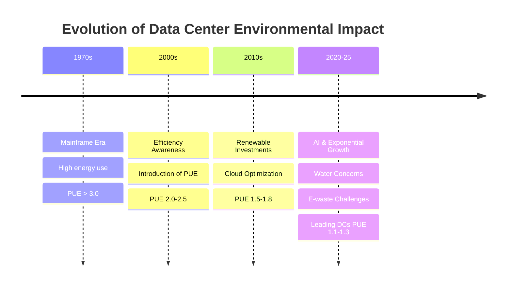
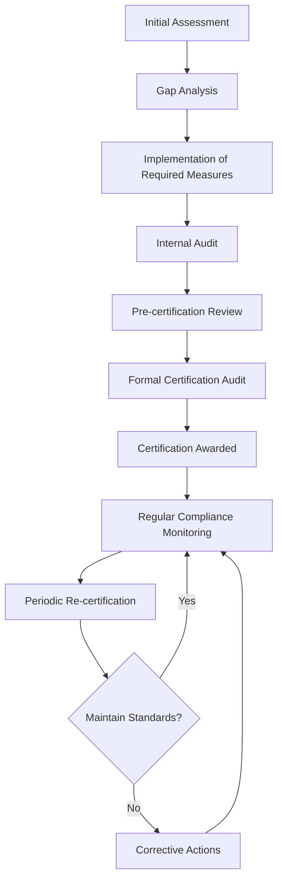
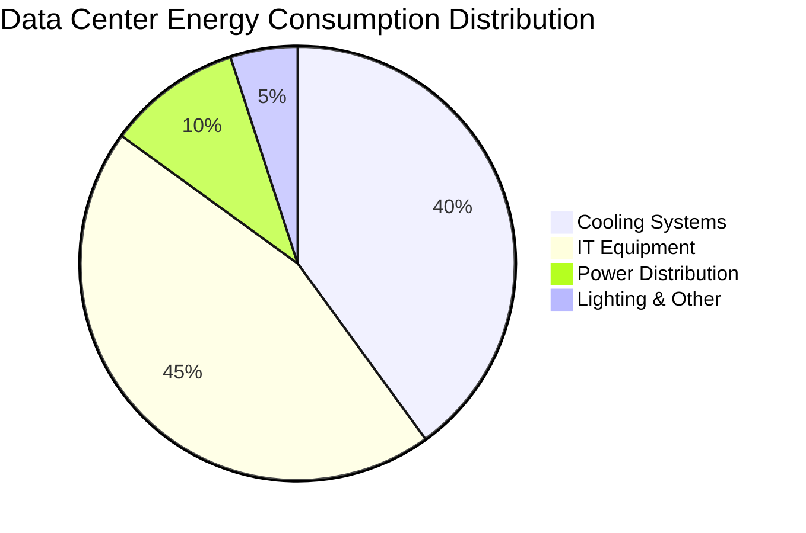
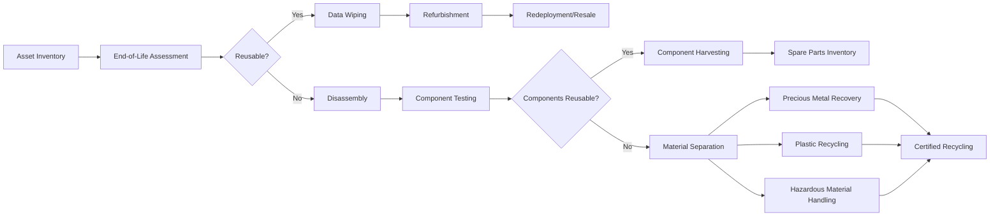

# 📚 Module 16: Green Data Centers

## Table of Contents
- [16.1 Introduction to Sustainability](#161-introduction-to-sustainability)
- [16.2 Need for Green Data Centers](#162-need-for-green-data-centers)
- [16.3 Green Data Center Challenges](#163-green-data-center-challenges)
- [16.4 Topics for Green Initiatives](#164-topics-for-green-initiatives)
- [16.5 Future Trends and Surrounding Topics](#165-future-trends-and-surrounding-topics)
- [16.6 Actionable Recommendations](#166-actionable-recommendations)
- [16.7 References and Further Reading](#167-references-and-further-reading)

## 16.1 Introduction to Sustainability

### Defining Sustainability in Data Centers

Sustainability in data centers refers to the design, construction, and operation of digital infrastructure facilities in ways that minimize environmental impact while maximizing operational efficiency and economic viability. This concept encompasses:

- **Environmental Stewardship**: Minimizing carbon emissions, reducing energy and water consumption, and properly managing e-waste.
- **Economic Viability**: Ensuring cost-effective operations while investing in green technologies that provide long-term benefits.
- **Social Responsibility**: Contributing positively to communities and ensuring ethical resource usage.

In the context of data centers, sustainability represents the balance between meeting growing digital demands and minimizing ecological footprints through innovative technologies, processes, and management practices.

### Importance of Reducing Carbon Footprint

Recent research from 2024-2025 highlights the growing urgency of reducing data center carbon footprints:

| Statistic | Value | Source |
|-----------|-------|--------|
| Global data center energy consumption (2024) | 3-4% of worldwide electricity | IEA Data Center Energy Report 2024 |
| Projected annual data center carbon emissions by 2025 | 2.6% of global GHG emissions | Climate Neutral Data Center Pact Annual Review 2024 |
| Reduction in carbon emissions achieved by top cloud providers (2020-2024) | 32% average | Cloud Carbon Footprint Consortium 2025 |
| Energy consumption increase in AI-focused data centers (2023-2025) | 47% | AI Computing Environmental Impact Study 2025 |

The International Energy Agency (IEA) reported in early 2024 that without significant intervention, data center energy demands could triple by 2030, placing extraordinary pressure on power grids and significantly increasing carbon emissions.

### Environmental Impact of IT Infrastructure

#### Historical Context
The environmental impact of IT infrastructure has evolved significantly:

- **1970s-1990s**: Early mainframe computers were energy-intensive, with minimal consideration for efficiency. A typical 1980s data center had a Power Usage Effectiveness (PUE) of 3.0 or higher.
  
- **2000-2010**: Growing awareness of energy concerns led to the first efficiency metrics. The Green Grid introduced PUE in 2007. Typical data centers operated at PUE values of 2.0-2.5.
  
- **2010-2020**: Major tech companies began investing in renewable energy. Cloud computing enabled resource optimization. Industry average PUE improved to 1.5-1.8.

#### Modern Context (2020-2025)
Modern data centers face intensified environmental challenges:

- **Exponential Data Growth**: Global data creation reached 97 zettabytes in 2024, a 27% increase from 2023 (IDC Data Report 2025).
  
- **AI and High-Performance Computing**: The energy demand for AI training has increased by 4,000% between 2020-2025 (Cambridge AI Energy Consumption Index 2025).
  
- **Water Usage**: Data centers consumed over 1.7 trillion liters of water globally in 2024 for cooling purposes (Global Water Research Institute 2025).

- **E-waste Generation**: IT equipment disposal reached 9.2 million tons in 2024, with only 22% being properly recycled (E-Waste Monitor 2025).

## 16.2 Need for Green Data Centers

### Role of Green IT in Modern Infrastructure

Green IT has transitioned from a corporate social responsibility initiative to a business imperative in modern infrastructure:

#### Strategic Benefits
- **Reduced Operational Costs**: Energy-efficient data centers can reduce operational expenses by 25-40%.
- **Improved Brand Reputation**: 76% of consumers prefer companies with demonstrated sustainability practices.
- **Regulatory Compliance**: Avoids potential fines and penalties from non-compliance with environmental regulations.
- **Risk Mitigation**: Reduces vulnerability to energy price volatility and resource scarcity.

#### Real-World Examples

1. **Google Cloud Platform**:
   - Uses machine learning to optimize cooling efficiency
   - Achieved a trailing twelve-month average PUE of 1.10 across global fleet (2024)
   - 90% less energy for the same compute power compared to five years ago

2. **Microsoft Azure**:
   - Implemented submarine data centers (Project Natick)
   - Uses hydrogen fuel cells for backup power
   - Committed to removing all historical carbon emissions by 2050

3. **Amazon Web Services**:
   - 85% renewable energy usage as of 2024
   - On track for 100% renewable energy by 2026
   - Innovative water recycling reducing consumption by 60%

### Regulatory Compliance and Green Certifications

The regulatory landscape for data centers has grown increasingly complex with numerous standards and certifications:

#### Major Green Certifications

1. **LEED (Leadership in Energy and Environmental Design)**
   - **Focus**: Building design and construction
   - **Key Metrics**: Energy efficiency, water usage, materials selection, indoor environmental quality
   - **Levels**: Certified, Silver, Gold, Platinum
   - **Validity**: 5 years

2. **ENERGY STAR for Data Centers**
   - **Focus**: Operational energy efficiency
   - **Key Metrics**: PUE, energy benchmarking
   - **Requirements**: Top 25% of energy performance nationwide
   - **Validity**: Annual recertification

3. **BREEAM (Building Research Establishment Environmental Assessment Method)**
   - **Focus**: Sustainable building design, construction, and operation
   - **Key Metrics**: Energy, water, waste, pollution, transport
   - **Levels**: Pass, Good, Very Good, Excellent, Outstanding
   - **Prevalence**: Most popular in Europe

4. **ISO 50001 (Energy Management)**
   - **Focus**: Systematic approach to energy management
   - **Requirements**: Energy policy, objectives, data analysis, continuous improvement
   - **Benefit**: Provides framework rather than specific performance targets
   - **Globally Recognized**: Applicable across different regions

5. **The Green Grid's Data Center Maturity Model**
   - **Focus**: Comprehensive data center efficiency
   - **Assessment Areas**: Power, cooling, compute, storage, network
   - **Levels**: 1 (Basic) to 5 (Visionary)

6. **EU Code of Conduct for Data Centres**
   - **Focus**: Voluntary initiative to reduce energy consumption
   - **Requirements**: Commitment to implement best practices
   - **Reporting**: Annual energy consumption and improvement reporting

#### Certification Process Flow

#### Regional Regulatory Requirements (2025)

| Region | Key Regulations | Requirements |
|--------|----------------|--------------|
| European Union | EU Green Deal Data Center Regulations | PUE < 1.3, 75% renewable energy, water reuse plans |
| United States | State-by-state (California SB-100, NY Climate Leadership Act) | Varied by state; carbon reporting, efficiency targets |
| China | China Data Center Energy Regulations | "5-3-2" standard: PUE targets based on climate zones |
| Australia | National Greenhouse and Energy Reporting | Mandatory reporting for facilities above threshold |
| Singapore | Green Data Centre Standard | Tropical Data Centre standards, moratorium on new centers |

## 16.3 Green Data Center Challenges

### Energy Consumption and Cooling Challenges

Energy consumption remains the most significant environmental and operational challenge for data centers:

#### Power Distribution Breakdown

A typical data center's energy distribution shows where efficiency improvements can be targeted:

#### Cooling System Challenges

1. **Heat Density Escalation**
   - Modern servers generate 10-15 kW per rack (compared to 4-5 kW in 2015)
   - AI servers can exceed 40 kW per rack
   - Challenge: Traditional cooling cannot handle these densities efficiently

2. **Legacy Infrastructure Limitations**
   - Older facilities designed for lower densities
   - Retrofitting challenges for modern cooling techniques
   - Historical raised-floor designs inefficient for high-density computing

3. **Geographic and Climate Constraints**
   - Facilities in warm climates require 35% more cooling energy
   - Water scarcity affects cooling options in many regions
   - Physical space limitations for cooling equipment

4. **Free Cooling Limitations**
   - Limited hours of suitable ambient conditions in many locations
   - Air quality and pollution concerns for air-side economization
   - Maintenance challenges for complex systems

#### Energy Challenges

1. **Increasing Computing Demand**
   - AI and ML workloads consume 3-5x more energy than traditional workloads
   - Edge computing proliferation creating thousands of mini data centers
   - Computing demand growing at 21% annually (2025) while efficiency improves at only 15%

2. **Renewable Energy Integration**
   - Intermittent availability of solar and wind power
   - Grid infrastructure limitations for renewable power transmission
   - Energy storage technology still developing for large-scale applications

3. **Energy Market Volatility**
   - Price fluctuations impact operational costs
   - Regulatory uncertainty regarding carbon pricing
   - Competing demands for renewable resources

### E-Waste and Recycling Programs

The rapid refresh cycles of IT equipment create significant e-waste challenges:

#### E-Waste Statistics (2025)
- **Average Server Lifespan**: 3-5 years (down from 5-7 years in 2015)
- **Annual IT Equipment Disposal**: 9.2 million tons globally
- **Recycling Rate**: Only 22% properly recycled
- **Toxic Materials**: One server contains 66+ potentially hazardous substances

#### Major Cloud Provider Recycling Programs

| Provider | Program Name | Key Initiatives | Results (2024-2025) |
|----------|-------------|----------------|---------------------|
| Google | Circular Economy Initiative | - Component reuse - Certified recycling partners - Design for disassembly | - 91% server components reused or recycled - Zero e-waste to landfill since 2022 - 4.3M kg of materials reclaimed |
| AWS | Hardware Lifecycle Management | - Decommissioning protocols - Second-life marketplace - Material recovery | - 80% of decommissioned hardware reused - 65% reduction in manufacturing emissions - 3.7M servers given second life |
| Microsoft | Circular Centers | - On-site disassembly labs - AI-driven part assessment - Server refurbishment | - 94% reuse/recycle rate - Extended server lifespan by 25% - 40,000 servers refurbished monthly |
| Meta | Zero Waste Initiative | - Hardware normalization - Repair program - Precious metal recovery | - 87% waste diversion from landfills - 175 tons of rare metals recovered - 2.3M hardware components reused |

#### E-Waste Management Process Flow

### Balancing Performance with Sustainability

The tension between high performance and sustainability goals presents significant challenges:

#### Performance Requirements vs. Energy Implications

| Requirement | Business Need | Sustainability Impact |
|-------------|--------------|----------------------|
| Low Latency | - 5ms response time targets - Real-time processing needs - User experience demands | - Requires more distributed data centers - Limits geographically optimal locations - Prevents full resource utilization |
| High Availability (99.999%) | - Zero downtime tolerance - 24/7 operational demands - Disaster recovery | - Redundant systems double energy use - Backup power systems (often diesel) - Overcapacity provisioning |
| Data Processing Speed | - Large data set processing - AI/ML workloads - Analytics performance | - High-performance hardware runs hotter - Increased cooling demands - Higher power density per rack |
| Storage Performance | - Fast data access - Low I/O latency - Large capacity needs | - SSD vs. HDD energy considerations - Temperature sensitivity - Power usage even when idle |

#### Balancing Strategies

1. **Workload Optimization**
   - Intelligent workload scheduling during renewable energy availability
   - Workload shifting to locations with lower carbon intensity
   - Dynamic power scaling based on SLA requirements

2. **Performance Tiering**
   - Different sustainability targets for different service tiers
   - Premium services with higher carbon offset requirements
   - Variable pricing based on sustainability impact

3. **Technical Innovations**
   - RISC-V and ARM architectures for better performance-per-watt
   - Specialized hardware for specific workloads (AI accelerators)
   - Dynamic voltage and frequency scaling optimizations

4. **SLA Renegotiation**
   - Educating customers on sustainability implications
   - Carbon-aware SLAs with flexibility during peak demand
   - Incentives for choosing "greener" performance options
