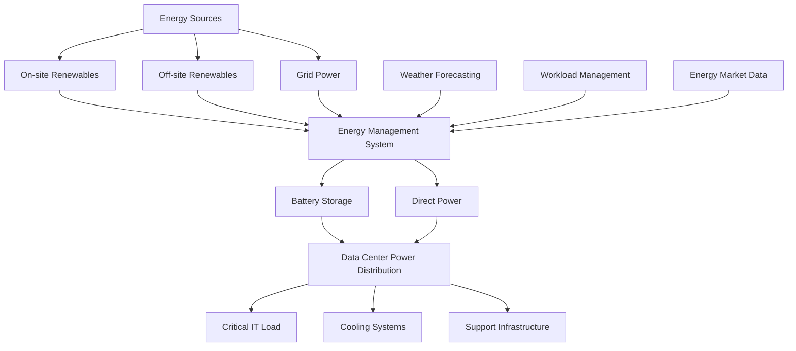
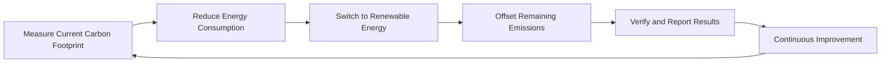
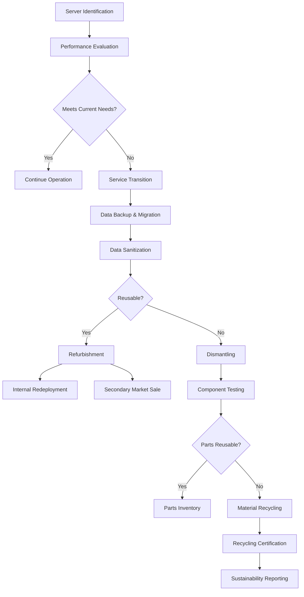
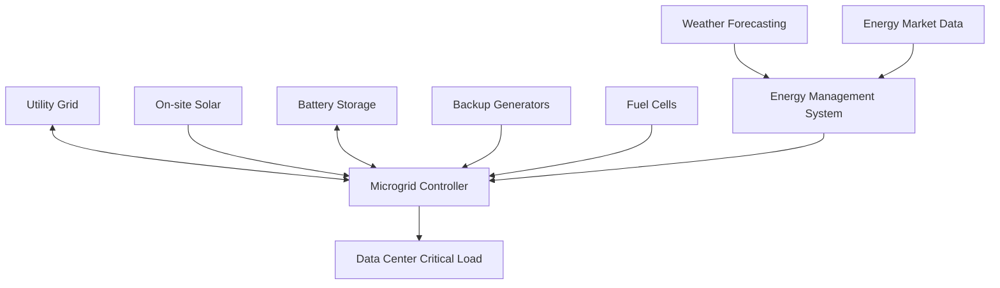
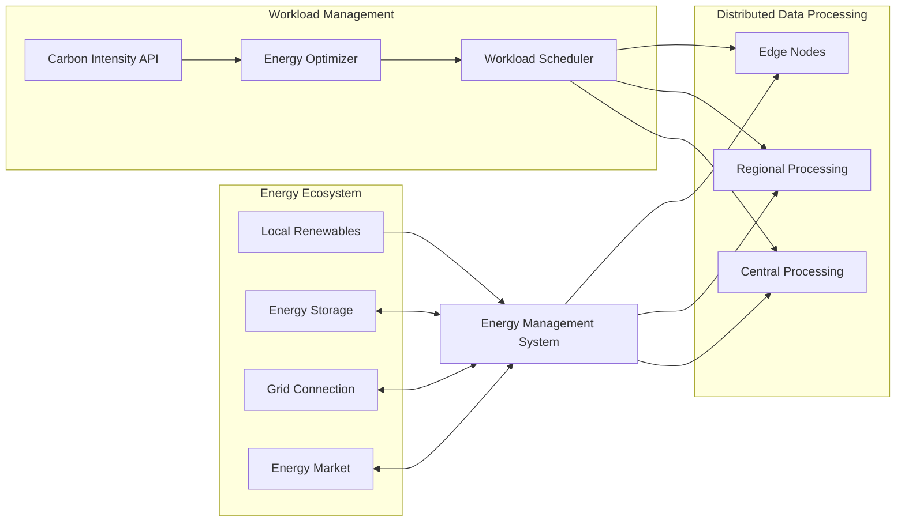
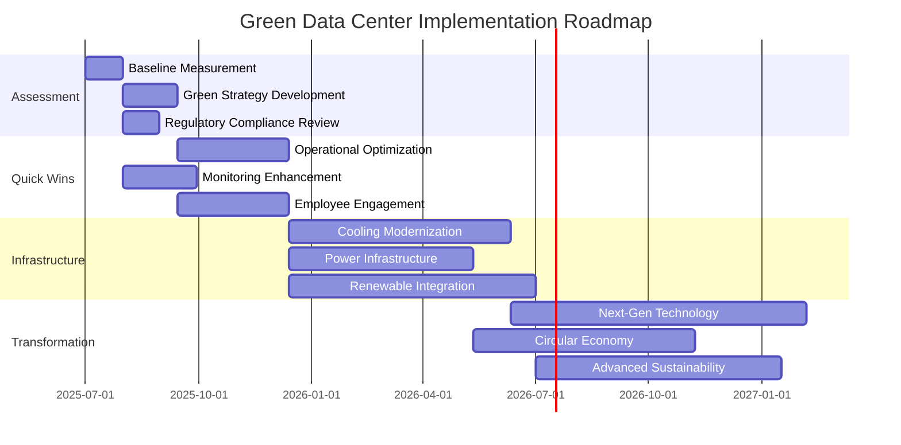

## 16.4 Topics for Green Initiatives

### Renewable Energy Sources in Data Centers

The integration of renewable energy sources has become fundamental to sustainable data center operations:

#### Renewable Energy Technologies and Implementation

1. **Solar Power**
   - **Implementation Models**:
     - On-site photovoltaic arrays
     - Power Purchase Agreements (PPAs)
     - Virtual PPAs and Renewable Energy Credits (RECs)
   
   - **Case Study**: Facebook's Los Lunas, NM data center (2024)
     - 130MW solar installation
     - 30% of facility's total energy needs
     - 7-year ROI with declining solar costs
   
   - **Challenges**:
     - Land space requirements (1MW requires ~5 acres)
     - Intermittent generation requiring storage
     - Efficiency degradation in extreme temperatures

2. **Wind Power**
   - **Implementation Models**:
     - Off-site dedicated wind farms
     - Hybrid on-site installations
     - Community wind projects
   
   - **Case Study**: Microsoft's Wyoming Wind Project (2023-2025)
     - 315MW capacity
     - Powers 90% of regional data center operations
     - Combined with 20MW battery storage system
   
   - **Challenges**:
     - Geographic limitations for optimal wind conditions
     - Transmission losses from remote locations
     - Visual and noise considerations for nearby communities

3. **Geothermal Energy**
   - **Implementation Models**:
     - Direct use for heating/cooling
     - Geothermal electricity generation
     - Ground-source heat pumps
   
   - **Case Study**: Iceland's Thor Data Center
     - 100% geothermal and hydroelectric power
     - Zero-carbon cooling via ambient air
     - Natural cooling reduces PUE to 1.07
   
   - **Challenges**:
     - Limited viable locations with geothermal resources
     - High initial drilling and infrastructure costs
     - Potential for seismic activity in some regions

4. **Hydroelectric Power**
   - **Implementation Models**:
     - Direct grid supply from hydro plants
     - Run-of-river installations
     - Pumped storage hydro for load balancing
   
   - **Case Study**: Google's Hamina, Finland data center
     - Repurposed paper mill using seawater cooling
     - Powered by regional hydroelectric grid
     - 45% lower energy costs than comparable facilities
   
   - **Challenges**:
     - Seasonal variations in water availability
     - Environmental concerns about river ecosystems
     - Limited new development opportunities

5. **Hydrogen and Fuel Cells**
   - **Implementation Models**:
     - Backup power replacement for diesel generators
     - Base load power in some locations
     - Combined heat and power systems
   
   - **Case Study**: Microsoft's Hydrogen Fuel Cell Project (2024)
     - 3MW hydrogen fuel cell system
     - 48-hour continuous operation capability
     - 99.999% reliability matching diesel performance
   
   - **Challenges**:
     - Hydrogen production and storage challenges
     - Cost premium over traditional solutions
     - Evolving safety regulations and standards

#### Renewable Energy Integration Architectures



### Innovations in Cooling

Cooling innovations represent some of the most impactful sustainability improvements in modern data centers:

#### Advanced Cooling Technologies

1. **Liquid Cooling**
   - **Direct-to-Chip (Cold Plate)**
     - Liquid coolant delivered directly to processor heat sinks
     - 45-50% more efficient than air cooling
     - Enables processor densities up to 350W per chip
     - Used in 28% of hyperscale data centers as of 2025

   - **Single-Phase vs. Two-Phase**
     - Single-phase: liquid remains liquid throughout (water, glycol)
     - Two-phase: liquid converts to gas, absorbing more heat
     - Two-phase offers 2-3x better heat transfer efficiency
     - Implementation cost 2x higher for two-phase systems

2. **Immersion Cooling**
   - **Single-Phase Immersion**
     - Servers submerged in dielectric fluid
     - No fans required, reducing energy use by 30%
     - PUE improvements of 0.2-0.3 compared to air cooling
     - Extended hardware lifespan (25-40% longer)

   - **Two-Phase Immersion**
     - Uses low-boiling-point dielectric fluid
     - Server heat causes fluid to boil and condense in a closed loop
     - Most efficient cooling method (95% less energy than air cooling)
     - Growing at 41% CAGR (2023-2025)

3. **Rear Door Heat Exchangers (RDHx)**
   - Water-cooled doors that absorb heat as air exits racks
   - Supports up to 35kW per rack without specialized room cooling
   - Retrofittable to existing infrastructure
   - 30-40% cooling energy reduction

4. **Free Cooling Innovations**
   - **Indirect Air-Side Economization**
     - Uses heat exchangers to transfer heat without mixing airstreams
     - Reduces contamination risks of direct air cooling
     - Viable in more climate zones than direct air cooling
     - 45-60% cooling cost reduction in suitable climates

   - **Evaporative Cooling Advancements**
     - Advanced media materials improving efficiency by 15%
     - Smart controls optimizing water vs. energy usage
     - Hybrid systems combining multiple methods
     - Water usage reduced by 30% since 2020 designs

5. **AI-Driven Cooling Optimization**
   - Machine learning for predictive temperature management
   - Real-time adjustments based on workload patterns
   - Google's DeepMind system achieved 30% cooling energy reduction
   - Enables dynamic cooling responses to changing conditions

#### Cooling System Architecture Comparison

| Cooling Method | PUE Impact | Water Usage | CAPEX | OPEX | Maximum Density | Key Benefits | Limitations |
|----------------|------------|-------------|-------|------|-----------------|--------------|-------------|
| Traditional Air | 1.4-1.8 | Low-Medium | $ | $$$ | 10-15 kW/rack | - Familiar technology<br>- Lower initial cost<br>- Ease of maintenance | - Space inefficient<br>- Limited density<br>- Higher operational cost |
| Direct-to-Chip | 1.2-1.4 | Low | $$ | $$ | 50-100 kW/rack | - Targeted cooling<br>- Works with existing infrastructure<br>- Lower noise | - Partial solution<br>- Requires specialized hardware<br>- Potential for leaks |
| Single-Phase Immersion | 1.1-1.2 | Very Low | $$$ | $ | 100-200 kW/rack | - Silent operation<br>- Dust elimination<br>- Hardware longevity | - High initial cost<br>- Maintenance complexity<br>- Specialized hardware |
| Two-Phase Immersion | 1.02-1.1 | Very Low | $$$$ | $ | 200+ kW/rack | - Highest efficiency<br>- Extreme density support<br>- Minimal moving parts | - Very high initial cost<br>- Specialized design<br>- Limited expertise available |
| Rear Door HX | 1.2-1.5 | Medium | $$ | $$ | 35-45 kW/rack | - Retrofittable<br>- Room-neutral heat<br>- Space efficient | - Partial solution<br>- Water near equipment<br>- Limited max density |
| Free Air Cooling | 1.1-1.3 | Low | $$ | $ | 10-20 kW/rack | - Very low operating cost<br>- Simple design<br>- Sustainability focus | - Climate dependent<br>- Filtering requirements<br>- Humidity management |

### Power Usage Effectiveness and Other Metrics

Measuring efficiency through standardized metrics remains crucial for data center sustainability:

#### Power Usage Effectiveness (PUE)

PUE remains the most widely used data center efficiency metric, though it's increasingly viewed as just one component of a broader sustainability framework:

**Definition**:
```
PUE = Total Facility Power / IT Equipment Power
```

**Components**:
- **Total Facility Power**: All power dedicated to the data center (IT, cooling, lighting, etc.)
- **IT Equipment Power**: Power used by computing equipment (servers, storage, network)

**Industry Benchmarks (2025)**:
- **Legacy Data Centers**: 1.7-2.0
- **Enterprise Average**: 1.4-1.6
- **Hyperscale Leaders**: 1.07-1.15
- **Theoretical Minimum**: 1.0

**PUE Calculator**:

```python
def calculate_pue(total_facility_power, it_equipment_power):
    """
    Calculate Power Usage Effectiveness (PUE)
    
    Args:
        total_facility_power: Total power consumed by the facility (kW)
        it_equipment_power: Power consumed by IT equipment (kW)
    
    Returns:
        PUE value as a float
    
    Raises:
        ValueError: If inputs are invalid
    """
    if total_facility_power <= 0 or it_equipment_power <= 0:
        raise ValueError("Power values must be positive")
    
    if it_equipment_power > total_facility_power:
        raise ValueError("IT equipment power cannot exceed total facility power")
    
    pue = total_facility_power / it_equipment_power
    
    return pue

# Example usage
try:
    # Example values
    total_power = 5000  # kW
    it_power = 4000  # kW
    
    pue_value = calculate_pue(total_power, it_power)
    print(f"PUE: {pue_value:.2f}")
    
    # PUE classification
    if pue_value < 1.2:
        efficiency = "Very Efficient"
    elif pue_value < 1.5:
        efficiency = "Efficient"
    elif pue_value < 2.0:
        efficiency = "Average"
    else:
        efficiency = "Inefficient"
    
    print(f"Efficiency Classification: {efficiency}")
    
except ValueError as e:
    print(f"Error: {e}")
```

**PUE Limitations**:
- Doesn't account for IT equipment efficiency
- Doesn't consider renewable energy sources
- No indication of water usage or carbon impact
- Can be manipulated through measurement methodology

#### Water Usage Effectiveness (WUE)

As data centers increasingly impact local water resources, WUE has become a critical sustainability metric:

**Definition**:
```
WUE = Annual Water Usage (liters) / IT Equipment Energy (kWh)
```

**Industry Benchmarks (2025)**:
- **Traditional Cooling**: 2.0-4.0 L/kWh
- **Best Practices**: 0.5-1.0 L/kWh
- **Advanced Systems**: <0.2 L/kWh
- **Air-Cooled Only**: 0.0 L/kWh

**WUE Calculator**:

```python
def calculate_wue(annual_water_usage_liters, annual_it_energy_kwh):
    """
    Calculate Water Usage Effectiveness (WUE)
    
    Args:
        annual_water_usage_liters: Annual water consumption (liters)
        annual_it_energy_kwh: Annual IT equipment energy usage (kWh)
    
    Returns:
        WUE value as a float (L/kWh)
    """
    if annual_water_usage_liters < 0 or annual_it_energy_kwh <= 0:
        raise ValueError("Invalid input values")
    
    wue = annual_water_usage_liters / annual_it_energy_kwh
    
    return wue

# Example calculation
annual_water = 5000000  # 5 million liters
annual_energy = 10000000  # 10 million kWh

wue_value = calculate_wue(annual_water, annual_energy)
print(f"WUE: {wue_value:.2f} L/kWh")
```

#### Data Center Infrastructure Efficiency (DCiE)

DCiE is the reciprocal of PUE, providing a percentage-based view of efficiency:

**Definition**:
```
DCiE = (1/PUE) × 100% = (IT Equipment Power / Total Facility Power) × 100%
```

**Industry Benchmarks (2025)**:
- **Legacy Data Centers**: 50-60%
- **Enterprise Average**: 65-75%
- **Hyperscale Leaders**: 85-95%
- **Theoretical Maximum**: 100%

**DCiE Calculator**:

```python
def calculate_dcie(pue=None, it_power=None, total_power=None):
    """
    Calculate Data Center Infrastructure Efficiency (DCiE)
    
    Args:
        pue: Power Usage Effectiveness value
        it_power: IT equipment power (kW)
        total_power: Total facility power (kW)
    
    Returns:
        DCiE value as a percentage
    
    Note:
        Provide either PUE or both power values
    """
    if pue is not None:
        if pue <= 0:
            raise ValueError("PUE must be positive")
        dcie = (1 / pue) * 100
    elif it_power is not None and total_power is not None:
        if it_power <= 0 or total_power <= 0:
            raise ValueError("Power values must be positive")
        if it_power > total_power:
            raise ValueError("IT power cannot exceed total power")
        dcie = (it_power / total_power) * 100
    else:
        raise ValueError("Either PUE or both power values must be provided")
    
    return dcie

# Example from PUE
print(f"DCiE from PUE 1.5: {calculate_dcie(pue=1.5):.1f}%")

# Example from power values
print(f"DCiE from powers: {calculate_dcie(it_power=4000, total_power=5000):.1f}%")
```

#### Comprehensive Efficiency Monitoring Dashboard

For real-time monitoring, a more comprehensive approach combines multiple metrics:

```python
import time
import random
import matplotlib.pyplot as plt
from datetime import datetime, timedelta

class DataCenterMonitor:
    def __init__(self):
        self.metrics_history = {
            'timestamp': [],
            'pue': [],
            'wue': [],
            'dcie': [],
            'carbon_intensity': [],
            'renewable_percentage': []
        }
    
    def collect_metrics(self, total_power, it_power, water_usage, 
                       carbon_intensity, renewable_percentage):
        """Collect and calculate all sustainability metrics"""
        timestamp = datetime.now()
        
        # Calculate metrics
        pue = total_power / it_power
        dcie = (it_power / total_power) * 100
        wue = water_usage / it_power
        
        # Store in history
        self.metrics_history['timestamp'].append(timestamp)
        self.metrics_history['pue'].append(pue)
        self.metrics_history['wue'].append(wue)
        self.metrics_history['dcie'].append(dcie)
        self.metrics_history['carbon_intensity'].append(carbon_intensity)
        self.metrics_history['renewable_percentage'].append(renewable_percentage)
        
        return {
            'timestamp': timestamp,
            'pue': pue,
            'wue': wue,
            'dcie': dcie,
            'carbon_intensity': carbon_intensity,
            'renewable_percentage': renewable_percentage
        }
    
    def generate_report(self, days=7):
        """Generate sustainability report for specified period"""
        if len(self.metrics_history['timestamp']) == 0:
            return "No data available for reporting"
        
        # Calculate averages
        avg_pue = sum(self.metrics_history['pue'][-days:]) / len(self.metrics_history['pue'][-days:])
        avg_wue = sum(self.metrics_history['wue'][-days:]) / len(self.metrics_history['wue'][-days:])
        avg_dcie = sum(self.metrics_history['dcie'][-days:]) / len(self.metrics_history['dcie'][-days:])
        avg_carbon = sum(self.metrics_history['carbon_intensity'][-days:]) / len(self.metrics_history['carbon_intensity'][-days:])
        avg_renewable = sum(self.metrics_history['renewable_percentage'][-days:]) / len(self.metrics_history['renewable_percentage'][-days:])
        
        report = f"""
```
DATA CENTER SUSTAINABILITY REPORT
        Period: Last {days} days
        
        EFFICIENCY METRICS:
        - Average PUE: {avg_pue:.2f}
        - Average DCiE: {avg_dcie:.2f}%
        - Average WUE: {avg_wue:.2f} L/kWh
        
        ENVIRONMENTAL IMPACT:
        - Average Carbon Intensity: {avg_carbon:.1f} gCO2e/kWh
        - Average Renewable Percentage: {avg_renewable:.1f}%
        
        RECOMMENDATIONS:
        {self._generate_recommendations(avg_pue, avg_wue, avg_renewable)}
        """
        
        return report
    
    def _generate_recommendations(self, pue, wue, renewable):
        """Generate tailored recommendations based on metrics"""
        recommendations = []
        
        if pue > 1.4:
            recommendations.append("- Consider cooling system optimization to improve PUE")
        if wue > 1.0:
            recommendations.append("- Implement water conservation measures to reduce WUE")
        if renewable < 75:
            recommendations.append("- Increase renewable energy procurement to meet sustainability goals")
            
        return "\n".join(recommendations) if recommendations else "All metrics within target ranges."

# Simulation example
def simulate_data_center_monitoring():
    """Simulate data collection for a week with random fluctuations"""
    monitor = DataCenterMonitor()
    
    # Simulate a week of hourly readings
    for hour in range(24 * 7):
        # Base values with some fluctuation
        total_power = 5000 + random.uniform(-200, 300)
        it_power = 4000 + random.uniform(-100, 150)
        water_usage = 3000 + random.uniform(-500, 500)
        carbon = 100 + random.uniform(-20, 40)
        renewable = 80 + random.uniform(-10, 10)
        
        # Collect metrics
        metrics = monitor.collect_metrics(total_power, it_power, water_usage, carbon, renewable)
        
    # Generate and print report
    report = monitor.generate_report()
    print(report)
    
    # Plot trends
    plt.figure(figsize=(12, 8))
    plt.subplot(2, 2, 1)
    plt.plot(monitor.metrics_history['timestamp'], monitor.metrics_history['pue'])
    plt.title('PUE Trend')
    plt.ylabel('PUE Value')
    
    plt.subplot(2, 2, 2)
    plt.plot(monitor.metrics_history['timestamp'], monitor.metrics_history['wue'])
    plt.title('WUE Trend')
    plt.ylabel('WUE (L/kWh)')
    
    plt.subplot(2, 2, 3)
    plt.plot(monitor.metrics_history['timestamp'], monitor.metrics_history['renewable_percentage'])
    plt.title('Renewable Energy Percentage')
    plt.ylabel('Percentage (%)')
    
    plt.subplot(2, 2, 4)
    plt.plot(monitor.metrics_history['timestamp'], monitor.metrics_history['carbon_intensity'])
    plt.title('Carbon Intensity')
    plt.ylabel('gCO2e/kWh')
    
    plt.tight_layout()
    # plt.show()  # Uncomment this when running in an environment that supports display

# simulate_data_center_monitoring()  # Run simulation


### Green Technologies

Beyond basic efficiency measures, cutting-edge green technologies are transforming data center sustainability:

#### Carbon-Neutral Hosting

Carbon-neutral hosting represents a holistic approach to eliminating the carbon footprint of data center operations:

1. **Real-time Carbon Intensity Monitoring**
   - APIs connecting to regional grid carbon intensity data
   - Workload scheduling based on carbon intensity
   - Google's Carbon-Intelligent Computing shifted 40% of non-urgent compute tasks to lower-carbon times (2024)

2. **Carbon Accounting Practices**
   - Scope 1: Direct emissions from owned facilities
   - Scope 2: Indirect emissions from purchased electricity
   - Scope 3: Value chain emissions (manufacturing, business travel, etc.)
   - ISO 14064-compliant carbon accounting methodologies

3. **Carbon Offset Programs**
   - Direct air capture investments
   - Reforestation and avoided deforestation projects
   - Renewable energy certificates (RECs)
   - Carbon offset quality verification through standards like Gold Standard and Verra

4. **Implementation Framework**



#### Server Decommissioning Strategies

Strategic decommissioning represents a critical but often overlooked aspect of data center sustainability:

1. **Asset Value Recovery Program**
   - Automated systems inventory and valuation
   - Secondary market assessment
   - Component harvesting for spare parts
   - 30-40% of server value recoverable through proper decommissioning

2. **Data Sanitization Standards**
   - NIST 800-88 compliant data wiping
   - Cryptographic erasure for SSDs
   - Physical destruction when necessary
   - Chain-of-custody documentation

3. **Decommissioning Process Flow**



4. **Case Study: Microsoft's Circular Centers**
   - On-site decommissioning labs
   - AI-driven parts assessment
   - 90% reuse rate of server components
   - $95M saved through component reuse in 2024

#### E-waste Lifecycle Management

Comprehensive e-waste management addresses the full lifecycle of electronic equipment:

1. **Circular Design Principles**
   - Design for disassembly and repair
   - Modular components that can be individually upgraded
   - Standardized parts across server generations
   - Reduced use of hazardous materials
   - Example: Dell's Concept Luna servers with 90% fewer screws and snap-fit components

2. **Extended Producer Responsibility (EPR)**
   - Take-back programs for end-of-life equipment
   - Financial incentives for hardware returns
   - Manufacturer responsibility for final disposal
   - Progress: 76% of major hardware vendors now offer EPR programs

3. **Rare Earth Element Recovery**
   - Neodymium and dysprosium from hard drive magnets
   - Gold and silver from circuit boards
   - Advanced hydrometallurgical recovery processes
   - 10-25x less energy than virgin mining

4. **E-waste Standards Compliance**
   - Basel Convention on transboundary movements
   - EU WEEE Directive requirements
   - R2 (Responsible Recycling) certification
   - e-Stewards certification for recycling partners

## 16.5 Future Trends and Surrounding Topics

### AI-Driven Cooling Optimization

Artificial intelligence is revolutionizing data center cooling efficiency:

1. **Machine Learning Applications**
   - **Predictive Temperature Management**
     - Neural networks analyzing thousands of sensors
     - 30-40% reduction in cooling energy use
     - Self-learning systems adapting to seasonal changes
     - Case study: Google DeepMind cooling optimization reduced PUE by 0.15

   - **Dynamic Workload Distribution**
     - Real-time server load balancing based on thermal conditions
     - Proactive thermal event prevention
     - 22% increase in cooling efficiency in hyperscale deployments

   - **Anomaly Detection**
     - Early detection of cooling failures or inefficiencies
     - Reduction in temperature-related hardware failures by 35%
     - AI-prioritized maintenance scheduling

2. **Digital Twin Implementation**
   - Virtual replicas of physical data centers
   - CFD (Computational Fluid Dynamics) modeling in real-time
   - What-if scenario testing for cooling optimizations
   - 15-20% additional efficiency gains beyond sensor-based optimization

3. **Future Developments (2025+)**
   - Autonomous cooling systems requiring minimal human intervention
   - Integration with building management systems for whole-facility optimization
   - Edge AI processors managing cooling at rack level
   - Cross-data center optimization at regional scale

### Smart Grids and Microgrids for Data Centers

The integration of data centers with intelligent electrical infrastructure is creating new sustainability opportunities:

1. **Bidirectional Grid Participation**
   - Data centers as grid stability resources
   - Demand response program participation
   - UPS batteries providing frequency regulation services
   - Google's Project Tango: 20MW grid services from data center batteries

2. **Microgrid Architectures**
   - **Components**:
     - On-site generation (solar, fuel cells, etc.)
     - Battery Energy Storage Systems (BESS)
     - Intelligent control systems
     - Grid connection with isolation capability

   - **Benefits**:
     - 99.9999% power reliability
     - 30-40% reduction in energy costs
     - 50-70% lower carbon emissions
     - Resilience against grid outages

3. **Implementation Model**



4. **Case Study: Switch's Gigawatt 1**
   - World's largest solar-powered data center project
   - 555MW solar generation capacity
   - 800MWh battery storage
   - 100% renewable power with 24/7 availability

### Green AI Models and Hosting

As AI energy demands grow exponentially, green AI has emerged as a critical focus area:

1. **Energy-Efficient Model Architectures**
   - Sparse neural networks using 10x less computation
   - Knowledge distillation shrinking models by 65-90%
   - Quantization reducing model size and power needs by 75%
   - Example: OpenAI's GPT-4 Efficiency variant using 80% less energy than standard GPT-4

2. **Training Optimization**
   - Carbon-aware training schedules utilizing renewable energy periods
   - Federated learning reducing data center computation
   - Transfer learning minimizing training rounds
   - Selective fine-tuning rather than full retraining

3. **Inference Efficiency**
   - Model-specific hardware accelerators (TPUs, NPUs)
   - Edge deployment reducing central data center load
   - Dynamic precision scaling based on requirements
   - Batch processing for non-time-sensitive inference

4. **Sustainability Metrics for AI**
   - FLOPs per watt for training/inference efficiency
   - Carbon impact per training run
   - Performance per watt improvement over previous generations
   - Dataset efficiency (performance gain per training example)

### Edge Computing and Sustainability

Edge computing presents both challenges and opportunities for data center sustainability:

1. **Distributed Energy Impact**
   - **Challenges**:
     - Potentially lower PUE in smaller facilities
     - Reduced economies of scale for cooling
     - More difficult to implement advanced cooling technologies
     - Limited real estate for renewable energy generation

   - **Opportunities**:
     - Reduced data transmission energy
     - Waste heat utilization for nearby buildings
     - Localized renewable energy integration
     - Reduced cooling needs in cooler climates

2. **Edge Energy Optimization Strategies**
   - Ambient cooling utilization
   - Liquid immersion for high-density edge nodes
   - Solar + battery combinations for off-grid locations
   - Sleep modes for intermittent workloads

3. **Architecture Models**

| Edge Architecture | Sustainability Advantages | Sustainability Challenges |
|-------------------|--------------------------|--------------------------|
| Micro Data Centers | - Local waste heat recovery<br>- Reduced transmission losses<br>- Community energy integration | - Lower economies of scale<br>- More difficult monitoring<br>- Potentially higher PUE |
| Telecom Edge | - Utilizes existing infrastructure<br>- Shared cooling systems<br>- Established power systems | - Aging power infrastructure<br>- Space constraints<br>- Limited renewable options |
| On-Premise Edge | - Zero transmission losses<br>- Direct business integration<br>- Simplified waste heat recovery | - Often retrofitted spaces<br>- Multiple small deployments<br>- Higher operational overhead |
| Regional Edge Hubs | - Balance of scale benefits<br>- Renewable deployment viable<br>- Modern infrastructure | - Still requires significant backhaul<br>- New construction impacts<br>- Land use considerations |

4. **Case Study: Schneider Electric's EcoStruxure Edge Data Center**
   - 12-42U prefabricated micro data centers
   - Integrated cooling and power management
   - 35% energy savings over traditional branch IT rooms
   - Remote management reducing maintenance visits by 63%

### Decentralized Data Centers and Energy Distribution

Decentralization trends are reshaping how data centers consume and interact with energy systems:

1. **Distributed Data Processing Models**
   - **Archipelago Model**:
     - Multiple smaller facilities instead of mega data centers
     - Located near renewable energy sources
     - Interconnected with high-speed, low-latency networks
     - 20-30% total energy reduction through optimal placement

   - **Hybrid Decentralization**:
     - Core hyperscale facilities for intensive workloads
     - Edge nodes for latency-sensitive applications
     - Dynamic workload shifting based on energy availability
     - Workload-specific placement optimization

2. **Energy Prosumer Approach**
   - Data centers both consuming and producing energy
   - Participation in local energy markets
   - Virtual power plant functionality through UPS batteries
   - Community microgrid integration

3. **Decentralized Energy Technologies**
   - Distributed energy resources (DERs)
   - Blockchain-based energy trading platforms
   - Peer-to-peer energy sharing networks
   - Localized storage with grid services capability

4. **Implementation Framework**



### Impact of Quantum Computing on Sustainability

Quantum computing presents a complex sustainability proposition:

1. **Energy Consumption Factors**
   - **Current Challenges**:
     - Extreme cooling requirements (near absolute zero)
     - High power density per compute unit
     - Significant infrastructure overhead
     - 25-50 kW per quantum computer vs. 1-2 kW for classical server

   - **Efficiency Potential**:
     - Quantum supremacy for specific problems (100-1000x less energy)
     - Single quantum algorithm replacing thousands of classical servers
     - Dramatic reduction in computation time and associated energy
     - Potential to solve currently intractable sustainability optimization problems

2. **Sustainability Applications**
   - Materials science for better battery technology
   - Carbon capture optimization
   - Climate modeling improvements
   - Energy grid optimization

3. **Hybrid Computing Models**
   - Quantum processing units (QPUs) alongside classical CPUs
   - Quantum acceleration for specific computational tasks
   - Shared quantum resources reducing overall system count
   - Energy allocation based on computational efficiency

4. **Cooling Innovations**
   - Recycling quantum cooling energy for facility heating
   - Cryogenic energy storage systems
   - Helium recovery and reuse systems
   - Ambient temperature quantum computing research

### Carbon Accounting for IT Infrastructure

Carbon accounting has evolved into a sophisticated practice for data center operators:

1. **Comprehensive Accounting Framework**
   - **Scope 1: Direct Emissions**
     - Diesel generator emissions
     - Refrigerant leaks
     - Natural gas usage
     - Company vehicle emissions

   - **Scope 2: Indirect Energy Emissions**
     - Purchased electricity
     - Purchased heating/cooling
     - Location-based vs. market-based accounting methods
     - Time-based emission factors

   - **Scope 3: Value Chain Emissions**
     - Embodied carbon in IT equipment
     - Employee commuting/travel
     - Waste disposal
     - Purchased goods and services

2. **Measurement Methodologies**
   - **Location-Based Accounting**:
     - Using regional grid emission factors
     - Average carbon intensity of local grid
     - Standard government emission factors
     - Does not reflect renewable energy purchases

   - **Market-Based Accounting**:
     - Reflects contractual instruments (RECs, PPAs)
     - Supplier-specific emission factors
     - Recognizes renewable energy investments
     - More complex calculation methodology

3. **Carbon Accounting Tools**
   - Real-time carbon intensity APIs
   - Server-level carbon tracking
   - Cloud carbon footprint calculators
   - Automated emissions dashboards

4. **Standards and Reporting**
   - Greenhouse Gas Protocol specifications
   - Science Based Targets initiative (SBTi)
   - Task Force on Climate-related Financial Disclosures (TCFD)
   - Carbon Disclosure Project (CDP) requirements

## 16.6 Actionable Recommendations

### Transitioning to Greener Data Centers

Organizations looking to implement green data center practices should consider the following phased approach:

#### Phase 1: Assessment and Planning (1-3 months)

1. **Baseline Measurement**
   - Conduct comprehensive energy audit
   - Establish current PUE, WUE, and carbon footprint
   - Document existing infrastructure and system dependencies
   - Identify quick wins and long-term opportunities

2. **Green Strategy Development**
   - Define sustainability goals and metrics
   - Establish executive sponsorship
   - Create cross-functional green team
   - Set realistic timeframes and budgets

3. **Regulatory Compliance Review**
   - Identify applicable environmental regulations
   - Determine certification requirements (LEED, ENERGY STAR, etc.)
   - Review incentive programs and tax benefits
   - Assess reporting obligations

#### Phase 2: Quick Wins Implementation (3-6 months)

1. **Operational Optimization**
   - Raise server inlet temperatures to ASHRAE recommended levels
   - Implement hot/cold aisle containment
   - Optimize airflow with blanking panels and floor tiles
   - Enable server power management features
   - Potential Impact: 10-15% energy reduction within 6 months

2. **Monitoring Enhancement**
   - Deploy environmental sensors throughout facility
   - Implement DCIM (Data Center Infrastructure Management) software
   - Establish sustainability dashboards
   - Create automated reporting for key metrics
   - Potential Impact: 5-8% additional efficiency through visibility

3. **Employee Engagement**
   - Train staff on sustainability practices
   - Implement incentive programs for green innovations
   - Share progress and successes broadly
   - Establish continuous improvement feedback loops
   - Potential Impact: Cultural shift supporting future initiatives

#### Phase 3: Infrastructure Upgrades (6-18 months)

1. **Cooling System Modernization**
   - Evaluate liquid cooling for high-density areas
   - Implement free cooling where climate permits
   - Upgrade to variable speed fans and pumps
   - Install smart cooling controls and AI optimization
   - Potential Impact: 20-35% reduction in cooling energy

2. **Power Infrastructure Improvements**
   - Upgrade to high-efficiency UPS systems (95%+ efficiency)
   - Implement lithium-ion batteries
   - Optimize power distribution architecture
   - Consider DC power distribution for new builds
   - Potential Impact: 10-15% power infrastructure efficiency gain

3. **Renewable Energy Integration**
   - Conduct renewable energy feasibility assessment
   - Implement on-site generation where viable
   - Explore Power Purchase Agreements (PPAs)
   - Consider Virtual PPAs and Renewable Energy Credits
   - Potential Impact: 50-100% reduction in carbon footprint

#### Phase 4: Transformation and Innovation (18+ months)

1. **Next-Generation Technology Adoption**
   - Evaluate immersion cooling for new deployments
   - Implement AI-driven infrastructure management
   - Explore edge computing for workload distribution
   - Consider software-defined power management
   - Potential Impact: PUE reduction to 1.1-1.2 range

2. **Circular Economy Implementation**
   - Establish comprehensive e-waste management program
   - Implement server component harvesting processes
   - Create procurement standards for sustainable hardware
   - Develop vendor sustainability requirements
   - Potential Impact: 80%+ reduction in landfill waste

3. **Advanced Sustainability Programs**
   - Implement carbon accounting for all IT operations
   - Develop water management and reduction strategies
   - Create sustainability reporting aligned with GRI standards
   - Pursue industry leadership in sustainable operations
   - Potential Impact: Recognized sustainability leadership

### Implementation Roadmap



### Cost-Benefit Analysis Framework

| Initiative | Implementation Cost | Annual Savings | ROI Period | Carbon Reduction | Other Benefits |
|------------|---------------------|----------------|------------|------------------|----------------|
| Hot/Cold Aisle Containment | $150-300/rack | $200-500/rack | 6-18 months | 15-25% | Improved equipment reliability |
| DCIM Implementation | $100K-500K | $50K-250K | 2-3 years | 10-15% | Enhanced capacity planning |
| Raise Inlet Temperatures | Minimal | $25K-100K | Immediate | 5-10% | Reduced mechanical wear |
| Free Air Cooling | $250K-1M | $100K-400K | 2-4 years | 20-30% | Water consumption reduction |
| Liquid Cooling | $500-1.5K/server | $200-600/server | 2-4 years | 25-40% | Higher compute density |
| On-site Solar | $1.5-3M/MW | $150-300K/MW | 5-8 years | 100% offset | Energy price stability |
| Server Refresh | Hardware cost | 30-60% power reduction | 2-3 years | 30-60% | Performance improvement |
| Immersion Cooling | $1K-3K/server | $300-900/server | 3-5 years | 40-50% | Extended hardware life |
| AI-Optimization | $100K-500K | $75K-350K | 1.5-3 years | 15-30% | Predictive maintenance |

## 16.7 References and Further Reading

### Industry Resources and Standards

1. **Key Industry Organizations**
   - The Green Grid - Data center efficiency standards organization
   - Uptime Institute - Data center reliability and sustainability standards
   - Open Compute Project - Open hardware design for efficiency
   - Climate Neutral Data Center Pact - European sustainability initiative

2. **Standards and Certifications**
   - ISO 50001:2018 - Energy management systems
   - ASHRAE TC 9.9 - Thermal guidelines for data centers
   - EN 50600 - European standard for data center design
   - LEED v4.1 Data Centers - Green building certification

### Landmark Research and Initiatives

1. **Google's Carbon-Free Data Center Initiative**
   - 24/7 carbon-free energy matching
   - Machine learning for cooling optimization
   - Carbon-intelligent computing platform
   - Published results: 67% time-matched clean energy in 2024

2. **Microsoft's Project Natick**
   - Underwater data center experiment
   - 8x lower failure rate than land facilities
   - Passive cooling using sea water
   - Zero water consumption for cooling
   - Phase 2 results (2024): Sustainable underwater operation proven viable

3. **Meta's Cold Storage Facility in Sweden**
   - 100% renewable powered
   - Free-air cooling utilizing Arctic climate
   - PUE of 1.07 achieved year-round
   - 70% less energy use than comparable facilities

4. **Amazon's Climate Pledge for Data Centers**
   - 100% renewable energy by 2026
   - Water positive commitment by 2030
   - Custom-designed air handling units reducing water usage by 60%
   - Development of AWS Sustainability Pillar in Well-Architected Framework

### Latest Research (2024-2025)

1. **Lawrence Berkeley National Laboratory (2024)**
   - "Data Center Energy Usage Trends 2025-2030"
   - Key finding: AI computing could increase data center energy use by 2-3x by 2030

2. **Stanford University Digital Economy Lab (2025)**
   - "Carbon-Optimal Computing: Balancing Performance and Sustainability"
   - Key finding: Workload-specific carbon optimization can reduce emissions by 45%

3. **MIT Technology Review (2024)**
   - "Liquid Cooling Economics: The Financial Case for Modernization"
   - Key finding: Immersion cooling ROI accelerating with higher density computing

4. **Cloud Carbon Footprint Consortium (2025)**
   - "Cloud Provider Sustainability Benchmark Report"
   - Key finding: Top providers achieved 32% carbon reduction since 2020

### Future Reading Recommendations

1. **Emerging Technologies**
   - "Quantum Computing's Environmental Promise and Peril" - Nature Energy (2024)
   - "Hydrogen Fuel Cells for Data Center Primary Power" - IEEE Transactions (2025)
   - "Microgrids and Energy Independence for Cloud Providers" - Energy Policy Journal (2024)

2. **Policy and Regulations**
   - "Global Data Center Sustainability Regulations Comparison" - Environmental Law Review (2025)
   - "Carbon Border Adjustment Mechanisms and Cloud Services" - Policy Studies Journal (2024)
   - "Setting Science-Based Targets for Data Center Operations" - SBTi Guide (2024)

3. **Industry Trends Reports**
   - Uptime Institute Global Data Center Survey 2025
   - Gartner Hype Cycle for Data Center and Cloud Sustainability 2025
   - IDC FutureScape: Worldwide Datacenter 2026 Predictions
