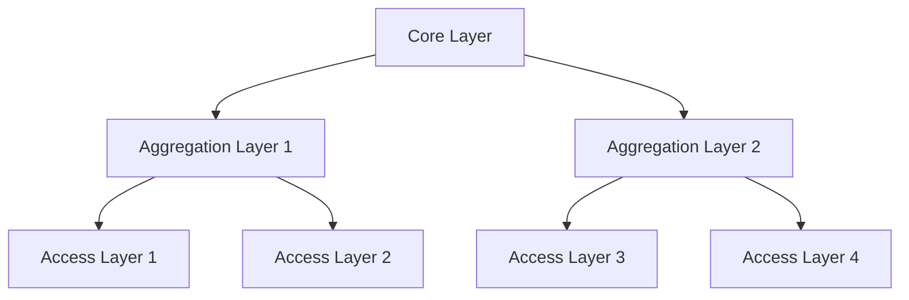

# Modern Data Center Infrastructure: A Comprehensive Guide
*From Traditional to Next-Generation Architecture*

## Table of Contents
1. [Core Infrastructure Components](#core-infrastructure-components)
2. [Advanced Networking Concepts](#advanced-networking-concepts)
3. [Modern Server Architecture](#modern-server-architecture)
4. [Network Architecture Deep Dive](#network-architecture-deep-dive)
5. [Storage Systems Evolution](#storage-systems-evolution)
6. [Cloud Infrastructure](#cloud-infrastructure)
7. [Container Orchestration](#container-orchestration)
8. [Application Architecture](#application-architecture)
9. [Hyperconverged Systems](#hyperconverged-systems)
10. [Industry Case Studies](#industry-case-studies)

## Core Infrastructure Components

### Physical Infrastructure Design

#### Advanced Power Distribution
```plaintext
Modern Power Architecture:
└── Utility Power
    ├── Primary Feed
    │   ├── Automatic Transfer Switch (ATS)
    │   └── Redundant UPS Systems (2N)
    ├── Secondary Feed
    │   ├── Generator Backup
    │   └── Fuel Management System
    └── Power Distribution Units (PDUs)
        ├── Branch Circuit Monitoring
        └── Intelligent Load Balancing
```

#### Innovative Cooling Solutions
- **Liquid Cooling Systems**
  - Direct-to-chip cooling
  - Immersion cooling (single and two-phase)
  - Rear-door heat exchangers
  - Precision cooling with AI control

#### Advanced Rack Design
```yaml
Modern Rack Specifications:
  height: 42U/48U
  width: 600mm/750mm
  depth: 1000mm/1200mm
  features:
    - Integrated cable management
    - Hot-aisle/cold-aisle containment
    - Built-in power monitoring
    - Dynamic airflow optimization
```

### Logical Infrastructure

#### Network Fabric Architecture


## Advanced Networking Concepts

### Software-Defined Networking (SDN)

#### Advanced SDN Architecture
```python
class SDNController:
    def __init__(self):
        self.topology = NetworkTopology()
        self.policy_engine = PolicyEngine()
        self.flow_table = FlowTable()
    
    def handle_packet_in(self, packet):
        path = self.topology.calculate_optimal_path(
            source=packet.source,
            destination=packet.destination,
            constraints=self.policy_engine.get_constraints()
        )
        
        self.install_flow_rules(path)
```

### Network Function Virtualization (NFV)

#### NFV Implementation
```yaml
nfv_chain:
  - name: "Security Service Chain"
    functions:
      - type: Firewall
        vendor: "Palo Alto"
        mode: "Active-Active"
      - type: LoadBalancer
        vendor: "F5"
        mode: "Active-Standby"
      - type: IDS
        vendor: "Snort"
        mode: "Passive"
```

## Modern Server Architecture

### Advanced Server Configurations

#### GPU-Accelerated Computing
```python
class GPUCluster:
    def __init__(self):
        self.gpu_pools = {
            'inference': InferencePool(),
            'training': TrainingPool(),
            'rendering': RenderingPool()
        }
    
    def schedule_workload(self, workload):
        pool = self.select_optimal_pool(workload)
        return pool.allocate_resources(workload)
```

## Network Architecture Deep Dive

### Advanced Overlay Networks

#### VXLAN Implementation
```python
class VXLANManager:
    def __init__(self):
        self.vnids = {}
        self.vtep_database = {}
    
    def create_segment(self, segment_id, vni):
        self.vnids[segment_id] = {
            'vni': vni,
            'vteps': set(),
            'multicast_group': self.allocate_multicast_group()
        }
```

## Storage Systems Evolution

### Modern Storage Architecture

#### Distributed Storage Implementation
```python
class DistributedStorageCluster:
    def __init__(self):
        self.nodes = []
        self.replication_factor = 3
        self.consistency_level = 'quorum'
    
    async def write_data(self, key, value):
        primary_nodes = self.get_primary_nodes(key)
        futures = [
            node.write(key, value)
            for node in primary_nodes
        ]
        
        results = await asyncio.gather(*futures)
        return self.verify_write_quorum(results)
```

## Container Orchestration

### Advanced Kubernetes Patterns

#### Custom Scheduler Implementation
```python
class GPUAwareScheduler:
    def __init__(self):
        self.node_manager = NodeManager()
        self.gpu_tracker = GPUResourceTracker()
    
    def schedule_pod(self, pod):
        required_gpu = pod.spec.gpu_requirements
        available_nodes = self.node_manager.get_nodes_with_gpu()
        
        scored_nodes = [
            (node, self.calculate_node_score(node, required_gpu))
            for node in available_nodes
        ]
        
        return max(scored_nodes, key=lambda x: x[1])[0]
```

## Industry Case Study: Global Financial Exchange Data Center

### Project Overview
Implementation of a modern data center for a financial exchange handling millions of transactions per second.

### Requirements
- Sub-microsecond latency
- 100% uptime during trading hours
- Real-time data replication
- Regulatory compliance
- Global distribution

### Architecture Implementation

#### Network Design
```yaml
network_topology:
  core_layer:
    switches:
      - type: Arista 7500R
        mode: Active-Active
        latency: "350ns"
    connections:
      - type: "100GbE"
        redundancy: "2N"
  
  distribution_layer:
    switches:
      - type: Arista 7280R
        mode: Active-Active
    connections:
      - type: "40GbE"
        redundancy: "N+1"
```

#### Storage Implementation
```python
class HighFrequencyTradeStorage:
    def __init__(self):
        self.memory_store = MemoryStore()
        self.persistent_store = PersistentStore()
        self.replication_manager = ReplicationManager()
    
    async def process_trade(self, trade):
        # Write to memory first
        await self.memory_store.write(trade)
        
        # Async replication to persistent storage
        self.replication_manager.queue_replication(trade)
        
        # Notify downstream systems
        await self.notify_subscribers(trade)
```

### Results
- Achieved 350ns network latency
- Zero downtime over 12 months
- 99.99999% data durability
- Regulatory compliance maintained
- 50% reduction in power usage

### Lessons Learned

1. **Technical Insights**
   - Importance of proper cable management for airflow
   - Need for custom monitoring solutions
   - Value of automation in compliance

2. **Operational Improvements**
   - Automated failover testing
   - Predictive maintenance
   - Real-time power optimization

3. **Business Impact**
   - Reduced trading latency by 40%
   - Increased trading volume capacity by 300%
   - Improved customer satisfaction scores

### Future Roadmap

1. **Technology Evolution**
   - Implementation of quantum-safe encryption
   - Integration of AI-driven cooling optimization
   - Expansion of edge computing capabilities

2. **Infrastructure Enhancement**
   - Migration to 400GbE network backbone
   - Implementation of liquid cooling
   - Enhanced automation capabilities

3. **Business Growth**
   - Support for new asset classes
   - Geographic expansion
   - Enhanced analytics capabilities

This case study demonstrates how modern data center concepts come together in a demanding real-world environment, showcasing the integration of advanced technologies to meet stringent business requirements.
