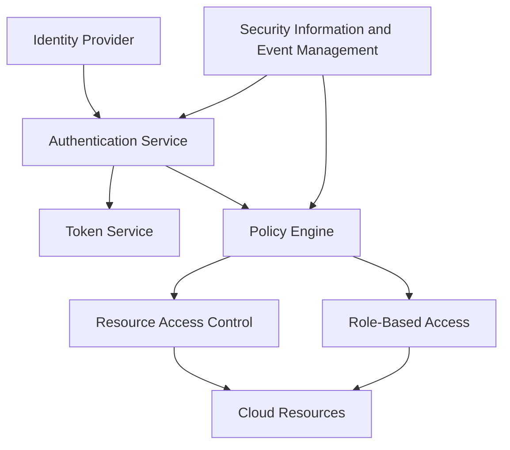
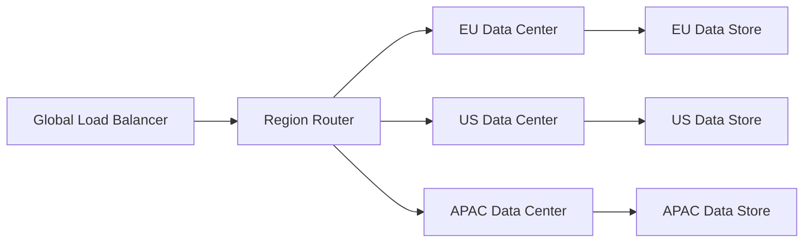
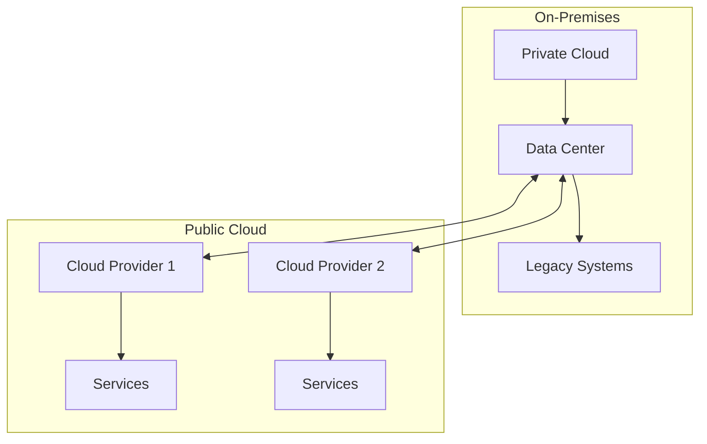
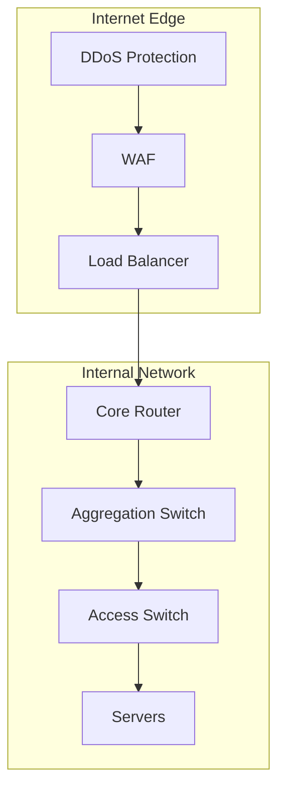
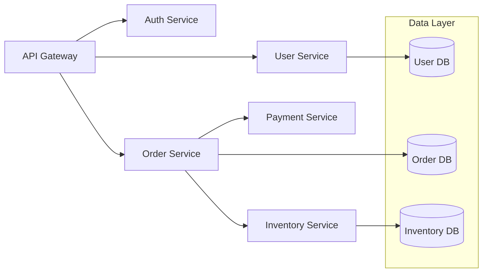
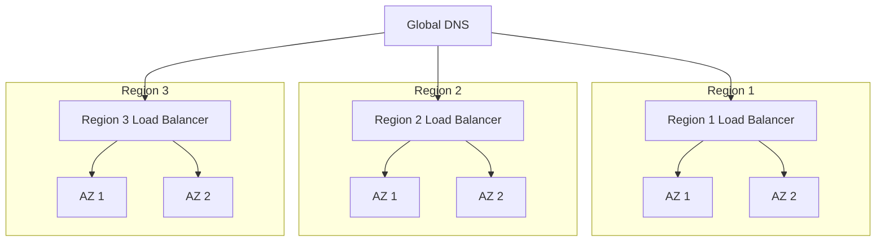
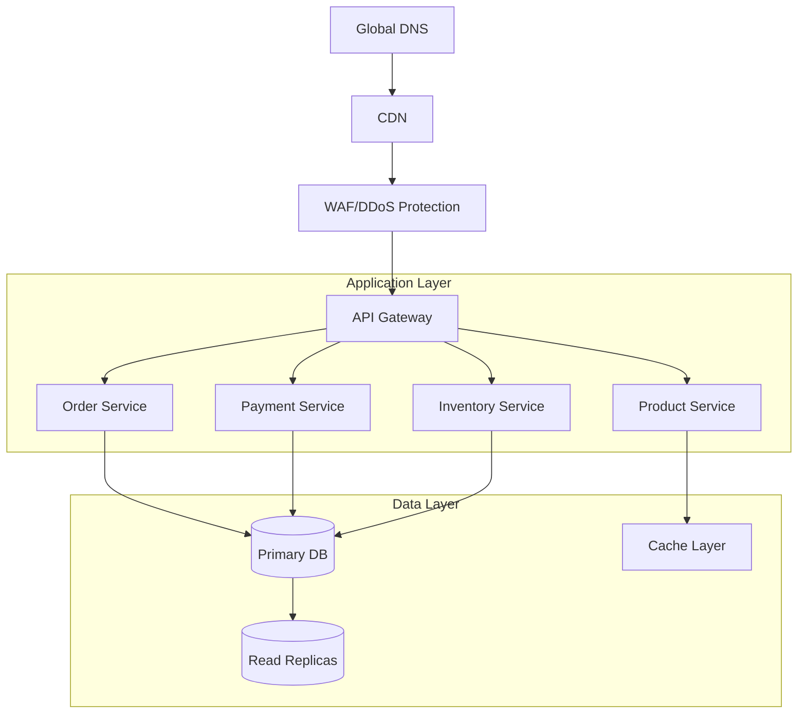

# Modern Data Center Architecture: A Comprehensive Guide
*Design Patterns, Implementation Strategies, and Best Practices*

## Table of Contents
1. [Cloud Resource Management](#cloud-resource-management)
2. [Multi-Cloud Architecture](#multi-cloud-architecture)
3. [Network Architecture](#network-architecture)
4. [Security Architecture](#security-architecture)
5. [Application Architecture](#application-architecture)
6. [High Availability Design](#high-availability-design)
7. [System Design Patterns](#system-design-patterns)
8. [Case Studies](#case-studies)

## Cloud Resource Management

### Advanced IAM Architecture



#### Implementation Example
```python
class ResourceAccessManager:
    def __init__(self):
        self.policy_engine = PolicyEngine()
        self.auth_service = AuthenticationService()
        self.audit_logger = AuditLogger()
        
    async def authorize_access(self, user, resource, action):
        # Verify user identity
        auth_token = await self.auth_service.validate_token(user.token)
        
        # Check permissions
        decision = await self.policy_engine.evaluate({
            'user': auth_token.claims,
            'resource': resource.metadata,
            'action': action,
            'context': self.get_request_context()
        })
        
        # Audit logging
        await self.audit_logger.log_access_attempt(
            user=user,
            resource=resource,
            action=action,
            decision=decision
        )
        
        return decision
```

### Data Sovereignty Architecture



## Multi-Cloud Architecture

### Advanced Hybrid Cloud Design



#### Cloud Integration Pattern
```python
class CloudIntegrationBroker:
    def __init__(self):
        self.providers = {
            'aws': AWSConnector(),
            'azure': AzureConnector(),
            'gcp': GCPConnector(),
            'onprem': OnPremConnector()
        }
        
    async def route_workload(self, workload):
        # Determine optimal placement
        placement = await self.calculate_optimal_placement(workload)
        
        # Deploy workload
        provider = self.providers[placement.provider]
        return await provider.deploy(
            workload,
            region=placement.region,
            constraints=placement.constraints
        )
        
    async def calculate_optimal_placement(self, workload):
        scores = {}
        for provider in self.providers.values():
            scores[provider.name] = await self.score_provider(
                provider,
                workload
            )
        return max(scores.items(), key=lambda x: x[1])[0]
```

## Network Architecture

### Advanced Network Layering



### Security Architecture

#### Zero Trust Implementation
```python
class ZeroTrustGateway:
    def __init__(self):
        self.identity_verifier = IdentityVerifier()
        self.device_verifier = DeviceVerifier()
        self.risk_engine = RiskEngine()
        
    async def process_request(self, request):
        # Continuous authentication
        identity = await self.identity_verifier.verify(
            request.credentials
        )
        
        # Device posture check
        device = await self.device_verifier.check(
            request.device_context
        )
        
        # Risk assessment
        risk_score = await self.risk_engine.calculate(
            identity=identity,
            device=device,
            context=request.context
        )
        
        # Dynamic policy enforcement
        return await self.enforce_policy(
            request,
            identity,
            device,
            risk_score
        )
```

## System Design Patterns

### Microservices Architecture



### Event-Driven Architecture

```python
class EventDrivenSystem:
    def __init__(self):
        self.event_bus = EventBus()
        self.handlers = {}
        
    async def publish_event(self, event):
        # Publish event to message bus
        await self.event_bus.publish(
            topic=event.topic,
            payload=event.payload,
            metadata=self.enrich_metadata(event)
        )
        
    def register_handler(self, event_type, handler):
        if event_type not in self.handlers:
            self.handlers[event_type] = []
        self.handlers[event_type].append(handler)
        
    async def process_event(self, event):
        handlers = self.handlers.get(event.type, [])
        return await asyncio.gather(*[
            handler(event)
            for handler in handlers
        ])
```

## High Availability Design

### Global Load Balancing



### Disaster Recovery Implementation

```python
class DisasterRecoveryOrchestrator:
    def __init__(self):
        self.health_checker = HealthChecker()
        self.failover_manager = FailoverManager()
        self.data_sync = DataSyncManager()
        
    async def monitor_health(self):
        while True:
            health_status = await self.health_checker.check_all()
            if health_status.requires_failover():
                await self.initiate_failover(health_status)
            
    async def initiate_failover(self, health_status):
        # Prepare secondary region
        await self.failover_manager.prepare_secondary()
        
        # Ensure data consistency
        sync_status = await self.data_sync.ensure_consistency()
        
        # Execute failover
        if sync_status.is_consistent():
            await self.failover_manager.execute_failover()
```

## Case Study: Global E-Commerce Platform

### Architecture Overview



### Implementation Details

#### Traffic Management
```yaml
load_balancing:
  global:
    algorithm: "geolocation_with_latency"
    health_checks:
      interval: "10s"
      timeout: "5s"
      unhealthy_threshold: 3
  regional:
    algorithm: "least_connections"
    session_persistence: true
    ssl_termination: true
```

#### Data Management
```python
class DataConsistencyManager:
    def __init__(self):
        self.db_cluster = DatabaseCluster()
        self.cache_cluster = CacheCluster()
        
    async def handle_write(self, data):
        # Write to primary
        write_result = await self.db_cluster.write(data)
        
        # Invalidate cache
        await self.cache_cluster.invalidate(
            keys=self.extract_cache_keys(data)
        )
        
        # Wait for replication
        await self.db_cluster.wait_for_replication(
            write_result.transaction_id
        )
```

### Results and Metrics
- 99.99% availability achieved
- Sub-100ms response time globally
- Zero data loss during failovers
- 5x improvement in throughput
- 70% reduction in operational costs

### Lessons Learned

1. **Architecture Decisions**
   - Importance of data locality
   - Need for async processing
   - Value of circuit breakers

2. **Operational Insights**
   - Automated failover testing
   - Chaos engineering benefits
   - Monitoring strategy evolution

3. **Future Improvements**
   - Edge computing integration
   - ML-based auto-scaling
   - Enhanced observability

This comprehensive guide demonstrates how modern data center architectural principles can be applied to create robust, scalable, and efficient systems. The combination of theoretical concepts and practical implementations provides a blueprint for building next-generation data center architectures.
