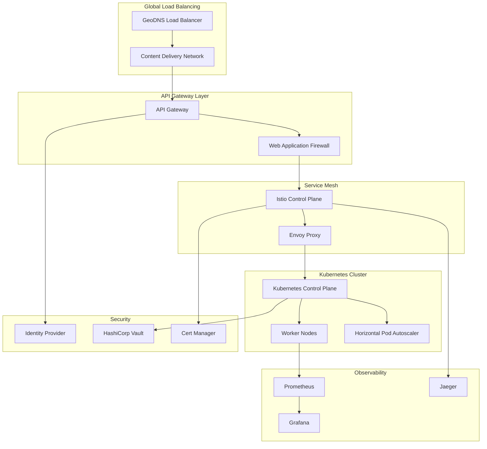

# Cloud Infrastructure Components
## A Comprehensive Technical Guide & Industry Best Practices 2024

## Table of Contents
1. [Server and Serverless Architectures](#1-serverless)
2. [Advanced Kubernetes Engineering](#2-kubernetes)
3. [Modern Identity and Access Management](#3-iam)
4. [Service Mesh with Istio](#4-istio)
5. [Advanced RBAC Patterns](#5-rbac)
6. [API Gateway Architecture](#6-gateways)
7. [Modern Load Balancing Techniques](#7-load-balancing)

## 1. Server and Serverless Architectures {#1-serverless}

### 1.1 Modern Serverless Patterns

#### Event-Driven Architecture Pattern
```typescript
// AWS Lambda function with EventBridge integration
import { EventBridgeEvent, Context } from 'aws-lambda';

interface OrderEvent {
    orderId: string;
    status: 'CREATED' | 'PROCESSED' | 'SHIPPED';
    timestamp: number;
}

export async function handleOrderEvent(
    event: EventBridgeEvent<'OrderStateChange', OrderEvent>,
    context: Context
): Promise<void> {
    const order = event.detail;
    
    // Implementation of the SAGA pattern for distributed transactions
    try {
        switch (order.status) {
            case 'CREATED':
                await initiatePaymentProcessing(order);
                break;
            case 'PROCESSED':
                await updateInventory(order);
                break;
            case 'SHIPPED':
                await notifyCustomer(order);
                break;
        }
    } catch (error) {
        // Compensating transaction
        await rollbackOrder(order, error);
    }
}
```

#### Modern Cold Start Mitigation
```python
# Using SnapStart with AWS Lambda
@lambda_handler
def handler(event, context):
    # Initialization code runs during snapshot creation
    global_init()
    
    def handle_request():
        # Request-specific code
        return process_request(event)
    
    return handle_request()

# Optimization using containerized functions
FROM public.ecr.aws/lambda/python:3.11
COPY --from=cache /var/task/dependencies /var/task/
COPY app.py /var/task/
CMD ["app.handler"]
```

### 1.2 Cost Optimization Patterns

#### FinOps Implementation
```python
def analyze_serverless_costs():
    """
    FinOps analysis for serverless workloads
    """
    return {
        'compute_costs': {
            'lambda_execution': calculate_lambda_costs(),
            'step_functions': calculate_step_function_costs(),
        },
        'storage_costs': {
            'dynamodb': calculate_dynamodb_costs(),
            's3': calculate_s3_costs(),
        },
        'network_costs': calculate_network_costs(),
        'recommendations': generate_cost_recommendations()
    }
```

## 2. Advanced Kubernetes Engineering {#2-kubernetes}

### 2.1 Modern Kubernetes Patterns

#### GitOps Implementation with Flux
```yaml
# Custom Flux Kustomization
apiVersion: kustomize.toolkit.fluxcd.io/v1
kind: Kustomization
metadata:
  name: production-apps
  namespace: flux-system
spec:
  interval: 1m
  path: ./clusters/production
  prune: true
  sourceRef:
    kind: GitRepository
    name: production-repo
  validation: client
  healthChecks:
    - apiVersion: apps/v1
      kind: Deployment
      name: frontend
      namespace: production
```

#### Advanced Pod Scheduling
```yaml
apiVersion: v1
kind: Pod
metadata:
  name: ml-training-pod
spec:
  affinity:
    nodeAffinity:
      requiredDuringSchedulingIgnoredDuringExecution:
        nodeSelectorTerms:
        - matchExpressions:
          - key: gpu-type
            operator: In
            values:
            - nvidia-a100
    podAntiAffinity:
      preferredDuringSchedulingIgnoredDuringExecution:
      - weight: 100
        podAffinityTerm:
          labelSelector:
            matchExpressions:
            - key: app
              operator: In
              values:
              - ml-training
          topologyKey: kubernetes.io/hostname
  containers:
  - name: ml-training
    image: ml-training:latest
    resources:
      limits:
        nvidia.com/gpu: 1
```

### 2.2 Kubernetes Operators

#### Custom Operator Example
```go
// Custom Operator for Database Management
package controllers

import (
    "context"
    "k8s.io/apimachinery/pkg/runtime"
    ctrl "sigs.k8s.io/controller-runtime"
    "sigs.k8s.io/controller-runtime/pkg/client"
)

type DatabaseReconciler struct {
    client.Client
    Scheme *runtime.Scheme
}

func (r *DatabaseReconciler) Reconcile(ctx context.Context, req ctrl.Request) (ctrl.Result, error) {
    var database customv1.Database
    if err := r.Get(ctx, req.NamespacedName, &database); err != nil {
        return ctrl.Result{}, client.IgnoreNotFound(err)
    }

    // Implement database lifecycle management
    if err := r.reconcileDatabase(ctx, &database); err != nil {
        return ctrl.Result{}, err
    }

    return ctrl.Result{RequeueAfter: time.Minute * 5}, nil
}
```

## 3. Modern Identity and Access Management {#3-iam}

### 3.1 Zero Trust Architecture

#### JWT-based Authentication
```typescript
interface JWTPayload {
    sub: string;
    roles: string[];
    permissions: string[];
    context: {
        tenant: string;
        environment: string;
    };
}

class ZeroTrustAuthenticator {
    async validateRequest(token: string, resource: string): Promise<boolean> {
        const payload = await this.verifyToken(token);
        return this.checkPermissions(payload, resource) &&
               this.validateContext(payload) &&
               this.validateDeviceIdentity();
    }

    private async validateContext(payload: JWTPayload): Promise<boolean> {
        const riskScore = await this.calculateRiskScore(payload);
        return riskScore < this.getThreshold(payload.context.environment);
    }
}
```

### 3.2 Modern OAuth2/OIDC Implementation

```typescript
// Modern OAuth2 implementation with PKCE
class OAuth2Client {
    private async generatePKCE(): Promise<PKCEPair> {
        const verifier = crypto.randomBytes(32).toString('base64url');
        const challenge = await crypto.subtle.digest(
            'SHA-256',
            new TextEncoder().encode(verifier)
        ).then(buf => Buffer.from(buf).toString('base64url'));

        return { verifier, challenge };
    }

    async initiateAuth(): Promise<string> {
        const { verifier, challenge } = await this.generatePKCE();
        this.storePKCEVerifier(verifier);

        return this.buildAuthorizationUrl({
            response_type: 'code',
            code_challenge: challenge,
            code_challenge_method: 'S256',
            // ... other parameters
        });
    }
}
```

## 4. Service Mesh with Istio {#4-istio}

### 4.1 Advanced Traffic Management

#### Circuit Breaking Pattern
```yaml
apiVersion: networking.istio.io/v1alpha3
kind: DestinationRule
metadata:
  name: circuit-breaker
spec:
  host: myservice
  trafficPolicy:
    connectionPool:
      tcp:
        maxConnections: 100
      http:
        http1MaxPendingRequests: 1
        maxRequestsPerConnection: 1
    outlierDetection:
      consecutive5xxErrors: 5
      interval: 30s
      baseEjectionTime: 30s
      maxEjectionPercent: 100
```

### 4.2 Modern Service Mesh Patterns

#### Canary Deployment
```yaml
apiVersion: networking.istio.io/v1alpha3
kind: VirtualService
metadata:
  name: canary-rollout
spec:
  hosts:
  - myservice
  http:
  - match:
    - headers:
        x-user-type:
          exact: beta
    route:
    - destination:
        host: myservice
        subset: v2
      weight: 20
  - route:
    - destination:
        host: myservice
        subset: v1
      weight: 80
```

## 5. Advanced RBAC Patterns {#5-rbac}

### 5.1 Fine-Grained Authorization

#### Attribute-Based Access Control (ABAC)
```python
class ABACAuthorizer:
    def authorize(self, subject: Subject, resource: Resource, action: Action) -> bool:
        policies = self.load_policies()
        
        for policy in policies:
            if self.matches_attributes(
                subject_attributes=subject.attributes,
                resource_attributes=resource.attributes,
                action_attributes=action.attributes,
                policy_rules=policy.rules
            ):
                return True
        
        return False

    def matches_attributes(self, **kwargs):
        # Complex attribute matching logic
        pass
```

## 6. API Gateway Architecture {#6-gateways}

### 6.1 Modern API Gateway Patterns

#### Rate Limiting Implementation
```python
class TokenBucketRateLimiter:
    def __init__(self, capacity: int, refill_rate: float):
        self.capacity = capacity
        self.refill_rate = refill_rate
        self.current_tokens = capacity
        self.last_refill = time.time()

    async def acquire(self, tokens: int = 1) -> bool:
        await self.refill()
        
        if self.current_tokens >= tokens:
            self.current_tokens -= tokens
            return True
        return False

    async def refill(self):
        now = time.time()
        time_passed = now - self.last_refill
        new_tokens = time_passed * self.refill_rate
        
        self.current_tokens = min(
            self.capacity,
            self.current_tokens + new_tokens
        )
        self.last_refill = now
```

## 7. Modern Load Balancing {#7-load-balancing}

### 7.1 Advanced Load Balancing Patterns

#### Global Load Balancing with GeoDNS
```python
class GeoDNSLoadBalancer:
    def route_request(self, client_ip: str, service: str) -> str:
        client_location = self.get_geo_location(client_ip)
        available_endpoints = self.get_healthy_endpoints(service)
        
        return self.select_optimal_endpoint(
            client_location,
            available_endpoints,
            self.get_real_time_metrics()
        )

    def select_optimal_endpoint(
        self,
        client_location: Location,
        endpoints: List[Endpoint],
        metrics: Dict[str, Metric]
    ) -> str:
        scored_endpoints = []
        
        for endpoint in endpoints:
            score = self.calculate_score(
                latency=self.measure_latency(client_location, endpoint),
                load=metrics[endpoint.id].load,
                health=metrics[endpoint.id].health_score
            )
            scored_endpoints.append((score, endpoint))
        
        return max(scored_endpoints, key=lambda x: x[0])[1].address
```

### 7.2 Modern Load Testing Pattern

```python
async def load_test_service(
    target_url: str,
    concurrent_users: int,
    duration_seconds: int
):
    async def user_session():
        async with aiohttp.ClientSession() as session:
            while True:
                try:
                    start_time = time.time()
                    async with session.get(target_url) as response:
                        response_time = time.time() - start_time
                        status = response.status
                        await metrics.record_request(response_time, status)
                except Exception as e:
                    await metrics.record_error(str(e))
                await asyncio.sleep(random.uniform(1, 5))

    users = [user_session() for _ in range(concurrent_users)]
    await asyncio.gather(*users)
```

## Industry Trends and Best Practices 2024

### 1. Platform Engineering
- Implementation of Internal Developer Platforms (IDP)
- Golden Paths for standardized deployment
- Self-service infrastructure provisioning

### 2. AI-Ops Integration
```python
class AIOpsController:
    def __init__(self):
        self.model = load_anomaly_detection_model()
        self.threshold = 0.95

    async def monitor_system_health(self):
        while True:
            metrics = await self.collect_system_metrics()
            prediction = self.model.predict(metrics)
            
            if prediction.anomaly_score > self.threshold:
                await self.trigger_automatic_remediation(prediction)
            
            await asyncio.sleep(60)
```

### 3. FinOps and Cost Optimization
```python
class ResourceOptimizer:
    def analyze_resource_usage(self):
        return {
            'recommendations': self.generate_recommendations(),
            'cost_analysis': self.analyze_costs(),
            'efficiency_metrics': self.calculate_efficiency()
        }

    def generate_recommendations(self):
        # Implement ML-based resource optimization
        pass
```

### 4. Security Patterns
```python
class ZeroTrustEnforcer:
    async def validate_request(
        self,
        request: Request,
        context: SecurityContext
    ) -> bool:
        return all([
            await self.verify_identity(request.identity),
            await self.verify_device(request.device),
            await self.verify_network(request.network),
            await self.verify_context(context)
        ])
```

## Modern Architecture Diagram



## Conclusion

This guide represents modern cloud infrastructure practices as of 2024. Regular updates and continuous learning are essential in this rapidly evolving field. Remember to always consider security, scal