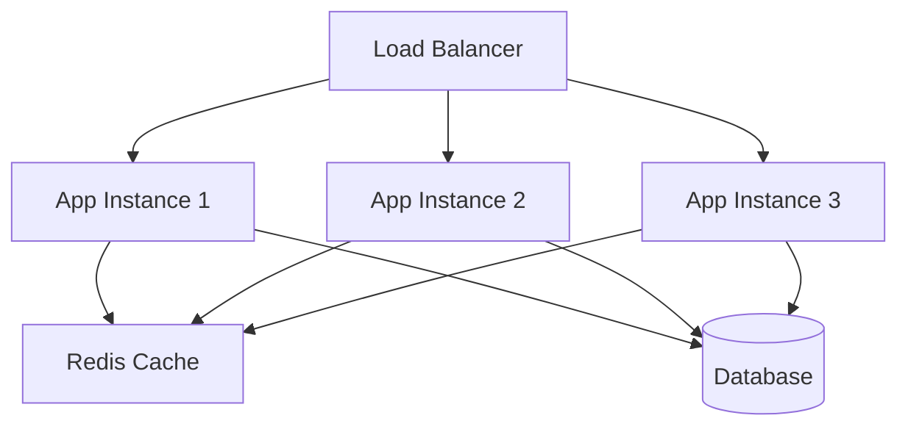
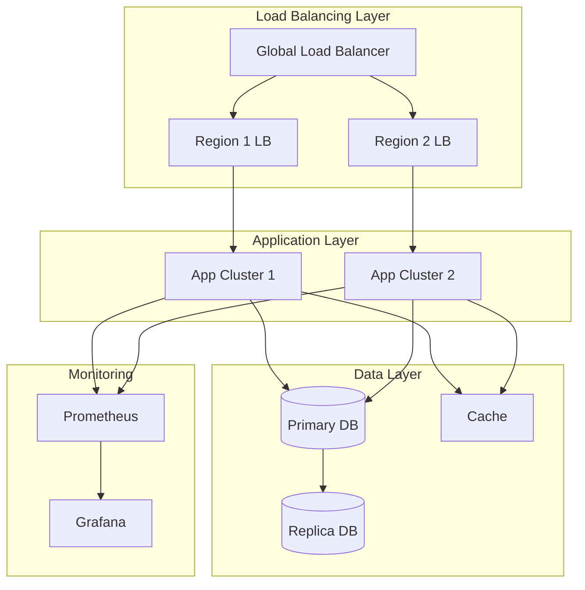

# Resource Planning in Modern Infrastructure
## A Comprehensive Technical Guide

## Table of Contents
- [1. Capacity Planning](#1-capacity-planning)
- [2. Capacity Management at Different Layers](#2-capacity-management)
- [3. Reliability in Data Transfer](#3-reliability-in-data-transfer)
- [4. Introduction to Sustainability](#4-sustainability)

## 1. Capacity Planning {#1-capacity-planning}

### 1.1 Understanding Resource Metrics

#### CPU Capacity
- **Basics**: 
  - CPU cores vs threads
  - Clock speed and its impact
  - CPU utilization patterns

- **Calculation Methods**:
```python
def calculate_cpu_requirement(concurrent_users, cpu_per_request, avg_request_time):
    """
    Calculate CPU cores needed based on workload
    
    Args:
        concurrent_users: Number of simultaneous users
        cpu_per_request: CPU utilization per request (0-1)
        avg_request_time: Average time per request in seconds
    
    Returns:
        Required CPU cores
    """
    return (concurrent_users * cpu_per_request * avg_request_time) / 60
```

- **Industry Best Practices**:
  - Target 65-75% CPU utilization
  - Reserve 20% for system processes
  - Plan for peak loads with 30% buffer

#### Memory Capacity
- **Key Concepts**:
  - Working set size
  - Page file usage
  - Memory leak detection

- **Calculation Example**:
```python
def calculate_memory_requirement(
    base_memory,
    memory_per_user,
    concurrent_users,
    buffer_percentage=0.2
):
    """
    Calculate total memory requirement
    
    Args:
        base_memory: Base system memory requirement (MB)
        memory_per_user: Memory per user session (MB)
        concurrent_users: Expected concurrent users
        buffer_percentage: Safety buffer (default 20%)
    
    Returns:
        Total memory requirement in MB
    """
    total = base_memory + (memory_per_user * concurrent_users)
    return total * (1 + buffer_percentage)
```

#### Network Capacity
- **Key Metrics**:
  - Bandwidth requirements
  - Packet loss tolerance
  - Latency requirements

```python
def calculate_bandwidth(
    avg_request_size,
    requests_per_second,
    protocol_overhead=0.1
):
    """
    Calculate required bandwidth
    
    Args:
        avg_request_size: Average size of request in bytes
        requests_per_second: Number of requests per second
        protocol_overhead: Overhead factor (default 10%)
    
    Returns:
        Required bandwidth in bytes per second
    """
    return avg_request_size * requests_per_second * (1 + protocol_overhead)
```

### 1.2 Performance Tuning and Optimization

#### Application Level Optimization
- **Code Optimization**:
```python
# Before optimization
def get_user_data(users):
    result = []
    for user in users:
        user_data = database.query(user.id)  # N database queries
        result.append(user_data)
    return result

# After optimization
def get_user_data(users):
    user_ids = [user.id for user in users]
    return database.query(user_ids)  # Single database query
```

#### Database Optimization
- **Index Design**:
```sql
-- Before optimization
SELECT * FROM orders 
WHERE customer_id = 123 
  AND order_date BETWEEN '2024-01-01' AND '2024-12-31';

-- After optimization (with proper index)
CREATE INDEX idx_customer_date ON orders(customer_id, order_date);
```

### 1.3 Predictive Analysis with AI/ML

#### Load Prediction Model
```python
from sklearn.ensemble import RandomForestRegressor

def train_load_predictor(historical_data):
    """
    Train a model to predict resource usage
    """
    model = RandomForestRegressor()
    features = ['hour_of_day', 'day_of_week', 'month', 'special_events']
    X = historical_data[features]
    y = historical_data['resource_usage']
    
    model.fit(X, y)
    return model
```

## 2. Capacity Management {#2-capacity-management}

### 2.1 Application Layer Scaling

#### Horizontal Scaling Architecture


#### Auto-scaling Configuration Example
```yaml
apiVersion: autoscaling/v2
kind: HorizontalPodAutoscaler
metadata:
  name: app-scaler
spec:
  scaleTargetRef:
    apiVersion: apps/v1
    kind: Deployment
    name: my-app
  minReplicas: 2
  maxReplicas: 10
  metrics:
  - type: Resource
    resource:
      name: cpu
      target:
        type: Utilization
        averageUtilization: 70
```

### 2.2 Network Management

#### Bandwidth Management
- **Traffic Shaping**:
```python
class TokenBucket:
    def __init__(self, capacity, fill_rate):
        self.capacity = capacity
        self.fill_rate = fill_rate
        self.tokens = capacity
        self.last_update = time.time()

    def consume(self, tokens):
        now = time.time()
        # Add tokens based on time passed
        self.tokens += (now - self.last_update) * self.fill_rate
        self.tokens = min(self.tokens, self.capacity)
        self.last_update = now

        if self.tokens >= tokens:
            self.tokens -= tokens
            return True
        return False
```

## 3. Reliability in Data Transfer {#3-reliability-in-data-transfer}

### 3.1 Protocol Implementation

#### gRPC Example
```protobuf
syntax = "proto3";

service DataTransfer {
    rpc StreamData (stream DataChunk) returns (TransferStatus);
}

message DataChunk {
    bytes data = 1;
    string checksum = 2;
}

message TransferStatus {
    bool success = 1;
    string error = 2;
}
```

### 3.2 Data Consistency

#### CAP Theorem Implementation
```python
class DistributedSystem:
    def write_with_consistency(self, data, consistency_level):
        if consistency_level == 'STRONG':
            return self._write_all_nodes(data)
        elif consistency_level == 'EVENTUAL':
            return self._write_async(data)

    def _write_all_nodes(self, data):
        """
        Strong consistency: Write to all nodes and wait for confirmation
        """
        successful_writes = 0
        for node in self.nodes:
            if node.write(data):
                successful_writes += 1
        
        return successful_writes == len(self.nodes)

    def _write_async(self, data):
        """
        Eventual consistency: Write to available nodes asynchronously
        """
        Thread(target=self._background_propagation, args=(data,)).start()
        return True
```

## 4. Sustainability {#4-sustainability}

### 4.1 Energy Efficiency Metrics

#### Power Usage Effectiveness (PUE) Calculation
```python
def calculate_pue(total_facility_power, it_equipment_power):
    """
    Calculate Power Usage Effectiveness
    
    PUE = Total Facility Power / IT Equipment Power
    Ideal PUE is 1.0
    """
    pue = total_facility_power / it_equipment_power
    return {
        'pue': pue,
        'efficiency_rating': 'Excellent' if pue < 1.2 else
                           'Good' if pue < 1.5 else
                           'Average' if pue < 2.0 else 'Poor'
    }
```

### 4.2 Carbon Footprint Monitoring

```python
def calculate_carbon_footprint(
    energy_consumption_kwh,
    renewable_percentage,
    carbon_intensity_factor
):
    """
    Calculate carbon footprint of data center operations
    
    Args:
        energy_consumption_kwh: Total energy consumption in kWh
        renewable_percentage: Percentage of renewable energy (0-1)
        carbon_intensity_factor: CO2 emissions per kWh
    
    Returns:
        CO2 emissions in metric tons
    """
    non_renewable_energy = energy_consumption_kwh * (1 - renewable_percentage)
    return (non_renewable_energy * carbon_intensity_factor) / 1000
```

## Industry Best Practices and Tips

1. **Capacity Planning**
   - Use automated tools for resource monitoring
   - Implement predictive scaling based on historical patterns
   - Regular load testing and performance benchmarking

2. **Reliability**
   - Implement circuit breakers for failure isolation
   - Use retry mechanisms with exponential backoff
   - Regular disaster recovery testing

3. **Sustainability**
   - Regular energy audits
   - Implementation of hot/cold aisle containment
   - Use of renewable energy sources where possible

## Real-world Architecture Example



## Conclusion

This guide covers the fundamental aspects of resource planning in modern infrastructure. Regular review and updates of these practices ensure optimal system performance and resource utilization.
