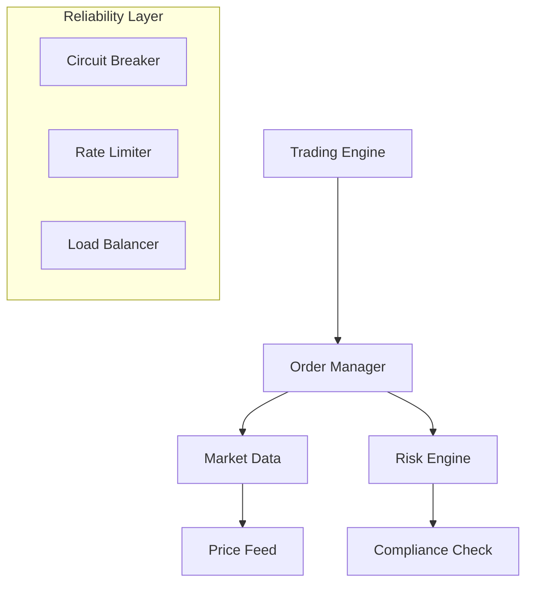

# Comprehensive Site Reliability Engineering Guide
*A Deep Dive into Principles, Practices, and Real-world Implementation*

## Table of Contents
1. [Core SRE Fundamentals](#core-sre-fundamentals)
2. [Advanced SRE Practices](#advanced-sre-practices)
3. [Lesser-Known SRE Techniques](#lesser-known-sre-techniques)
4. [Industry Best Practices](#industry-best-practices)
5. [Comprehensive Case Study](#comprehensive-case-study)

## Core SRE Fundamentals

### 1. The SRE Mindset
- **Engineering-Driven Operations**
  - Focus on automation over manual intervention
  - Data-driven decision making
  - Systems thinking approach
  - Proactive problem prevention

- **Key Principles**
  - Embrace risk
  - Service level objectives
  - Elimination of toil
  - Monitoring as code
  - Gradual change management

### 2. Service Level Engineering

#### SLI Selection Framework
```
Criteria for choosing SLIs:
1. User-facing impact
2. Controllable metrics
3. Leading indicators
4. Statistical significance
5. Collection feasibility
```

#### Advanced SLO Strategies
- **Adaptive SLOs**
  - Dynamic adjustment based on business cycles
  - Customer-tier specific objectives
  - Geographic variation consideration

- **SLO Implementation**
  ```
  Example SLO Framework:
  - Availability: 99.95% success rate
  - Latency: 95% of requests < 200ms
  - Durability: 99.999999% data retention
  - Freshness: 99% < 30s stale
  ```

### 3. Advanced Monitoring and Observability

#### Comprehensive Telemetry
- **Metric Types**
  1. Business metrics
  2. Application metrics
  3. Infrastructure metrics
  4. Network metrics
  5. Security metrics

- **Advanced Instrumentation**
  ```python
  # Example custom metric implementation
  def instrument_request(func):
      @wraps(func)
      def wrapper(*args, **kwargs):
          start = time.time()
          result = func(*args, **kwargs)
          duration = time.time() - start
          
          # Record detailed metrics
          metrics.histogram(
              'request_duration_seconds',
              duration,
              tags={
                  'function': func.__name__,
                  'status': result.status,
                  'region': get_region(),
                  'customer_tier': get_customer_tier()
              }
          )
          return result
      return wrapper
  ```

## Advanced SRE Practices

### 1. Intelligent Alerting Systems

#### Alert Design Principles
- Signal-to-noise ratio optimization
- Alert correlation and grouping
- Dynamic thresholds
- Context-aware routing

```yaml
# Example advanced alert configuration
alerts:
  - name: "API Latency Degradation"
    condition: |
      rate(http_request_duration_seconds[5m]) > 
      avg_over_time(http_request_duration_seconds[7d]) + 
      2 * stddev_over_time(http_request_duration_seconds[7d])
    labels:
      severity: warning
      category: performance
    annotations:
      summary: "API latency outside normal bounds"
      dashboard: "${grafana_url}/d/api-performance"
      playbook: "${runbook_url}/api-latency"
    inhibitions:
      - source_match:
          alertname: "Downstream Service Degradation"
```

### 2. Advanced Automation Patterns

#### Self-Healing Systems
```python
class AutoRemediation:
    def __init__(self):
        self.healing_strategies = {
            'pod_crash': self.restart_pod,
            'high_memory': self.scale_resources,
            'connection_pool': self.reset_connections
        }
        
    async def detect_and_heal(self):
        while True:
            anomalies = await self.detect_anomalies()
            for anomaly in anomalies:
                if strategy := self.healing_strategies.get(anomaly.type):
                    await strategy(anomaly)
                    await self.verify_healing(anomaly)
```

## Lesser-Known SRE Techniques

### 1. Advanced Reliability Patterns

#### Circuit Breaker with Advanced Features
```python
class SmartCircuitBreaker:
    def __init__(self):
        self.failure_count = 0
        self.last_failure_time = None
        self.state = 'closed'
        self.partial_open_threshold = 0.1
        
    async def call(self, func, *args, **kwargs):
        if self.state == 'open':
            if self.should_attempt_reset():
                return await self.partial_open_call(func, *args, **kwargs)
            raise CircuitBreakerOpen()
            
        try:
            result = await func(*args, **kwargs)
            self.record_success()
            return result
        except Exception as e:
            self.record_failure(e)
            raise

    async def partial_open_call(self, func, *args, **kwargs):
        if random.random() < self.partial_open_threshold:
            # Allow small percentage of traffic through
            return await self.call(func, *args, **kwargs)
        raise CircuitBreakerOpen()
```

### 2. Advanced Load Shedding
```python
class AdaptiveLoadShedder:
    def __init__(self):
        self.latency_threshold = 100  # ms
        self.cpu_threshold = 80  # percent
        self.memory_threshold = 85  # percent
        
    async def should_accept_request(self, request):
        # Calculate health score
        system_health = await self.get_system_health()
        request_priority = self.get_request_priority(request)
        
        if system_health < 0.5:
            return request_priority > 0.8
            
        if system_health < 0.7:
            return request_priority > 0.5
            
        return True
        
    def get_request_priority(self, request):
        factors = {
            'user_tier': self.get_user_tier_score(request),
            'endpoint_criticality': self.get_endpoint_criticality(request),
            'retry_attempt': self.get_retry_penalty(request)
        }
        return weighted_average(factors)
```

## Industry Best Practices

### 1. Advanced Capacity Planning

#### Predictive Scaling
```python
class PredictiveScaler:
    def __init__(self):
        self.model = load_trained_model()
        self.scaling_threshold = 0.75
        
    async def predict_load(self, window_size='1h'):
        metrics = await self.get_historical_metrics(window_size)
        features = self.extract_features(metrics)
        prediction = self.model.predict(features)
        
        return {
            'predicted_load': prediction,
            'confidence': self.calculate_confidence(prediction),
            'recommended_capacity': self.calculate_capacity(prediction)
        }
```

### 2. Advanced Incident Management

#### Smart Incident Routing
```python
class IncidentRouter:
    def __init__(self):
        self.expertise_matrix = self.load_expertise_matrix()
        self.availability_tracker = AvailabilityTracker()
        
    async def route_incident(self, incident):
        required_skills = self.analyze_incident(incident)
        available_engineers = await self.availability_tracker.get_available()
        
        best_match = self.find_best_match(
            required_skills,
            available_engineers,
            incident.severity
        )
        
        return await self.create_incident_assignment(best_match, incident)
```

## Comprehensive Case Study: Global Financial Trading Platform

### Background
A major financial trading platform handling $50B daily trading volume needed to achieve 99.999% availability while maintaining sub-millisecond latency.

### Challenges
1. Zero downtime requirement during trading hours
2. Regulatory compliance requirements
3. Global distribution needs
4. Real-time data consistency
5. Complex dependency chain

### Implementation

#### 1. Architecture Evolution


#### 2. SLO Implementation
```yaml
slo:
  trading_engine:
    availability: 99.999%
    latency_p99: 1ms
    data_consistency: 100%
  market_data:
    freshness: 50ms
    accuracy: 99.999%
  risk_engine:
    processing_time: 100μs
    accuracy: 100%
```

#### 3. Advanced Monitoring Setup
```python
class TradingMetrics:
    def __init__(self):
        self.metrics = {
            'order_flow': OrderFlowMetrics(),
            'market_data': MarketDataMetrics(),
            'risk': RiskMetrics(),
            'system': SystemMetrics()
        }
        
    async def collect_all(self):
        metrics = await asyncio.gather(*[
            metric.collect()
            for metric in self.metrics.values()
        ])
        
        return self.correlate_metrics(metrics)
```

#### 4. Automation Implementation
```python
class TradingAutomation:
    def __init__(self):
        self.strategies = {
            'failover': FailoverStrategy(),
            'scaling': ScalingStrategy(),
            'recovery': RecoveryStrategy()
        }
        
    async def handle_event(self, event):
        strategy = self.select_strategy(event)
        await strategy.execute(event)
        await self.verify_system_state()
```

### Results
- Achieved 99.9999% availability
- Reduced latency to 100μs p99
- Zero data inconsistencies
- 100% compliance adherence
- 50% reduction in operational costs

### Key Learnings

1. **Technical Insights**
   - Importance of microsecond-level monitoring
   - Need for custom tooling
   - Value of canary deployments

2. **Process Improvements**
   - Automated compliance checks
   - Real-time risk assessment
   - Predictive alerting

3. **Cultural Changes**
   - Enhanced collaboration
   - Knowledge sharing
   - Incident ownership

### Future Roadmap

1. **Technical Evolution**
   - ML-based anomaly detection
   - Automated capacity planning
   - Enhanced self-healing

2. **Process Enhancement**
   - Automated compliance reporting
   - Enhanced disaster recovery
   - Advanced chaos engineering

This case study demonstrates the practical application of advanced SRE principles in a highly demanding environment. The implementation showcases how various SRE concepts work together to achieve exceptional reliability.
