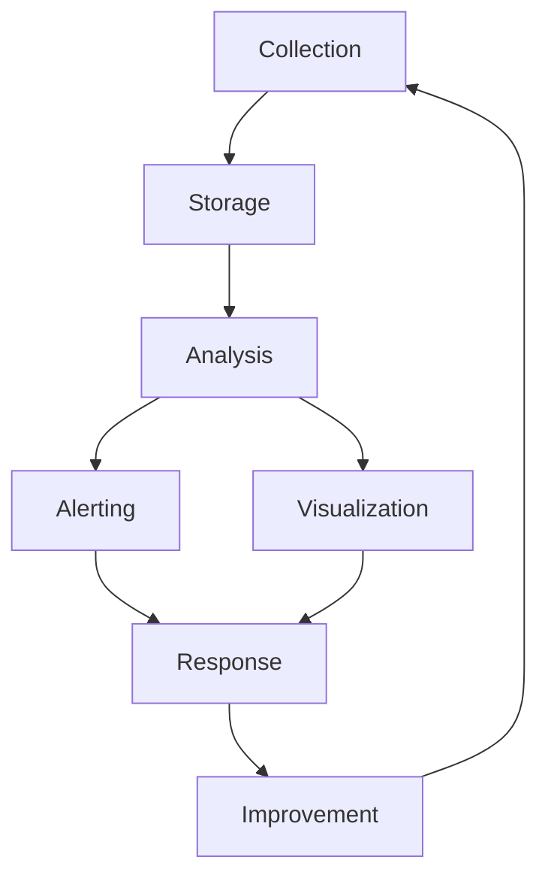
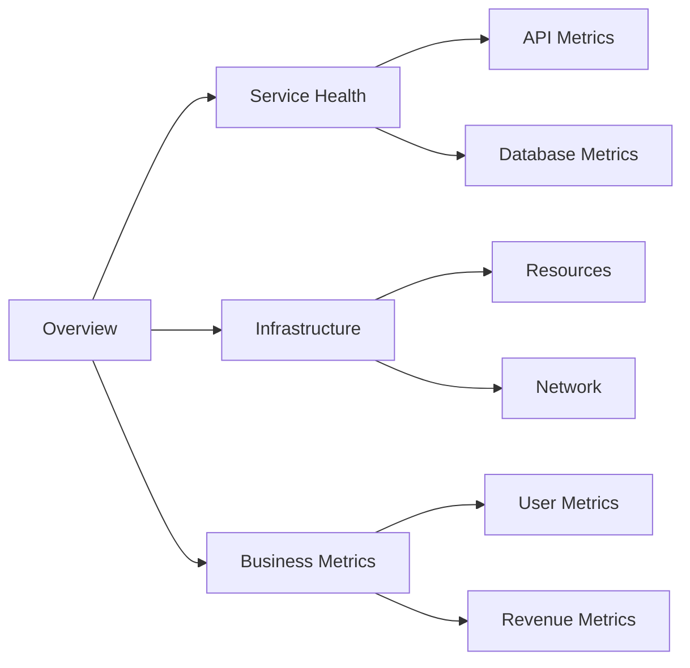

# Comprehensive Guide to Measurement and Key Performance Metrics

## Table of Contents
1. [Introduction to Metrics and Monitoring](#introduction)
2. [Defining Key Metrics](#key-metrics)
3. [Performance Benchmarks](#performance-benchmarks)
4. [Application-Specific Metrics](#application-metrics)
5. [Infrastructure Metrics](#infrastructure-metrics)
6. [Log Aggregation and Analysis](#log-aggregation)
7. [Industry Best Practices](#best-practices)
8. [Advanced Topics](#advanced-topics)

## 1. Introduction <a name="introduction"></a>

### What are Metrics?
Metrics are quantifiable measures used to track and assess the status of a specific process or activity. In software systems, metrics help us understand:
- System health and performance
- User experience
- Business impact
- Technical debt
- Resource utilization

### The Four Golden Signals
Google's Site Reliability Engineering (SRE) book defines four golden signals:
1. Latency
2. Traffic
3. Errors
4. Saturation

## 2. Defining Key Metrics <a name="key-metrics"></a>

### 2.1 Availability Metrics

#### Uptime
- **Definition**: Percentage of time a system is operational
- **Calculation**: `Uptime = (Total Time - Downtime) / Total Time × 100%`
- **Industry Standards**:
  - Five nines (99.999%) = 5.26 minutes downtime/year
  - Four nines (99.99%) = 52.56 minutes downtime/year
  - Three nines (99.9%) = 8.76 hours downtime/year

```python
def calculate_availability(total_time_seconds, downtime_seconds):
    uptime = (total_time_seconds - downtime_seconds) / total_time_seconds * 100
    return f"{uptime:.3f}%"

# Example usage
total_time = 30 * 24 * 3600  # 30 days in seconds
downtime = 15 * 60  # 15 minutes in seconds
availability = calculate_availability(total_time, downtime)
print(f"System availability: {availability}")
```

### 2.2 Latency Metrics

#### Network Latency
- **Round Trip Time (RTT)**
- **Time to First Byte (TTFB)**
- **DNS Resolution Time**

#### Application Latency
- **Request Processing Time**
- **Database Query Time**
- **Service Call Time**

```python
from statistics import mean, median, quantiles

def calculate_latency_percentiles(latency_samples):
    sorted_samples = sorted(latency_samples)
    return {
        'p50': median(sorted_samples),
        'p90': quantiles(sorted_samples, n=10)[8],
        'p95': quantiles(sorted_samples, n=20)[18],
        'p99': quantiles(sorted_samples, n=100)[98],
        'mean': mean(sorted_samples)
    }
```

### 2.3 Throughput Metrics

#### Requests Per Second (RPS)
- **Definition**: Number of requests processed per second
- **Monitoring**: Use moving averages for stability
- **Industry standard**: Varies by application type
  - Web APIs: 100-1000 RPS
  - Microservices: 1000-10000 RPS
  - High-frequency trading: 100000+ RPS

```python
def calculate_rps(request_count, time_period_seconds):
    return request_count / time_period_seconds

# Example monitoring system implementation
class RPSMonitor:
    def __init__(self, window_size=60):
        self.window_size = window_size
        self.requests = []
        
    def record_request(self, timestamp):
        self.requests.append(timestamp)
        # Remove old requests
        cutoff = timestamp - self.window_size
        self.requests = [t for t in self.requests if t > cutoff]
    
    def get_current_rps(self):
        return len(self.requests) / self.window_size
```

## 3. Performance Benchmarks <a name="performance-benchmarks"></a>

### 3.1 Benchmarking Tools

#### JMeter Test Plan Example
```xml
<?xml version="1.0" encoding="UTF-8"?>
<jmeterTestPlan version="1.2" properties="5.0">
  <hashTree>
    <TestPlan guiclass="TestPlanGui" testclass="TestPlan" testname="API Load Test">
      <elementProp name="TestPlan.user_defined_variables" elementType="Arguments">
        <collectionProp name="Arguments.arguments"/>
      </elementProp>
      <stringProp name="TestPlan.comments"></stringProp>
      <boolProp name="TestPlan.functional_mode">false</boolProp>
      <ThreadGroup guiclass="ThreadGroupGui" testclass="ThreadGroup" testname="Users">
        <intProp name="ThreadGroup.num_threads">100</intProp>
        <intProp name="ThreadGroup.ramp_time">10</intProp>
        <HTTPSamplerProxy>
          <stringProp name="HTTPSampler.domain">api.example.com</stringProp>
          <stringProp name="HTTPSampler.path">/endpoint</stringProp>
          <stringProp name="HTTPSampler.method">GET</stringProp>
        </HTTPSamplerProxy>
      </ThreadGroup>
    </TestPlan>
  </hashTree>
</jmeterTestPlan>
```

### 3.2 Types of Performance Testing

#### Load Testing
- **Definition**: Testing system behavior under expected load
- **Tools**: 
  - JMeter
  - K6
  - Gatling
- **Key Metrics**:
  - Response time
  - Throughput
  - Error rate
  - Resource utilization

#### Stress Testing
- **Purpose**: Find breaking points
- **Approach**: Gradually increase load until failure
- **Key Metrics**:
  - Maximum RPS
  - Breaking point
  - Recovery time

#### Capacity Testing
- **Goal**: Determine system limits
- **Metrics**:
  - Maximum concurrent users
  - Maximum throughput
  - Resource limits

## 4. Application-Specific Metrics <a name="application-metrics"></a>

### 4.1 API Performance Metrics

```python
from dataclasses import dataclass
from datetime import datetime
import statistics

@dataclass
class APIMetrics:
    endpoint: str
    method: str
    response_time: float
    status_code: int
    timestamp: datetime

class APIMonitor:
    def __init__(self):
        self.metrics = []
    
    def record_request(self, endpoint, method, response_time, status_code):
        metric = APIMetrics(
            endpoint=endpoint,
            method=method,
            response_time=response_time,
            status_code=status_code,
            timestamp=datetime.now()
        )
        self.metrics.append(metric)
    
    def get_p99_latency(self, endpoint=None):
        filtered_metrics = [
            m.response_time for m in self.metrics
            if endpoint is None or m.endpoint == endpoint
        ]
        return statistics.quantiles(filtered_metrics, n=100)[98]
```

### 4.2 Database Metrics

#### Query Performance
- **Key Metrics**:
  - Query execution time
  - Index usage
  - Cache hit ratio
  - Connection pool utilization

```python
import time
from contextlib import contextmanager

class DatabaseMetrics:
    def __init__(self):
        self.query_times = {}
        self.cache_hits = 0
        self.cache_misses = 0
    
    @contextmanager
    def measure_query(self, query_name):
        start_time = time.time()
        try:
            yield
        finally:
            duration = time.time() - start_time
            if query_name not in self.query_times:
                self.query_times[query_name] = []
            self.query_times[query_name].append(duration)
    
    def get_slow_queries(self, threshold_seconds=1.0):
        slow_queries = {}
        for query, times in self.query_times.items():
            avg_time = sum(times) / len(times)
            if avg_time > threshold_seconds:
                slow_queries[query] = avg_time
        return slow_queries
```

## 5. Infrastructure Metrics <a name="infrastructure-metrics"></a>

### 5.1 System Resource Monitoring

Let's create a Prometheus configuration example:

```yaml
global:
  scrape_interval: 15s
  evaluation_interval: 15s

scrape_configs:
  - job_name: 'node'
    static_configs:
      - targets: ['localhost:9100']
  
  - job_name: 'application'
    static_configs:
      - targets: ['localhost:8080']

rule_files:
  - 'alert.rules'

alerting:
  alertmanagers:
    - static_configs:
        - targets: ['localhost:9093']
```

### 5.2 Cloud Monitoring

#### AWS CloudWatch Example
```python
import boto3
import datetime

class CloudWatchMetrics:
    def __init__(self):
        self.cloudwatch = boto3.client('cloudwatch')
    
    def get_cpu_utilization(self, instance_id, period=300):
        response = self.cloudwatch.get_metric_statistics(
            Namespace='AWS/EC2',
            MetricName='CPUUtilization',
            Dimensions=[{'Name': 'InstanceId', 'Value': instance_id}],
            StartTime=datetime.datetime.utcnow() - datetime.timedelta(hours=1),
            EndTime=datetime.datetime.utcnow(),
            Period=period,
            Statistics=['Average']
        )
        return response['Datapoints']
```

## 6. Log Aggregation and Analysis <a name="log-aggregation"></a>

### 6.1 ELK Stack Configuration

```yaml
# Filebeat configuration
filebeat.inputs:
- type: log
  enabled: true
  paths:
    - /var/log/application/*.log
  fields:
    application: myapp
    environment: production

output.elasticsearch:
  hosts: ["elasticsearch:9200"]
  index: "myapp-%{+yyyy.MM.dd}"

# Logstash configuration
input {
  beats {
    port => 5044
  }
}

filter {
  grok {
    match => { "message" => "%{TIMESTAMP_ISO8601:timestamp} %{LOGLEVEL:level} %{GREEDYDATA:message}" }
  }
}

output {
  elasticsearch {
    hosts => ["elasticsearch:9200"]
    index => "myapp-%{+YYYY.MM.dd}"
  }
}
```

## 7. Industry Best Practices <a name="best-practices"></a>

### 7.1 Monitoring Strategy



### 7.2 Alert Design

- **USE Method**:
  - Utilization
  - Saturation
  - Errors

### 7.3 Dashboard Design



## 8. Advanced Topics <a name="advanced-topics"></a>

### 8.1 Machine Learning for Anomaly Detection

```python
from sklearn.ensemble import IsolationForest

class AnomalyDetector:
    def __init__(self):
        self.model = IsolationForest(contamination=0.1)
        
    def train(self, metrics_data):
        self.model.fit(metrics_data)
    
    def detect_anomalies(self, new_data):
        predictions = self.model.predict(new_data)
        return predictions == -1  # -1 indicates anomaly
```

### 8.2 Distributed Tracing

```python
from opentelemetry import trace
from opentelemetry.trace import Status, StatusCode

tracer = trace.get_tracer(__name__)

def process_request(request_id):
    with tracer.start_as_current_span("process_request") as span:
        span.set_attribute("request.id", request_id)
        
        try:
            # Process request
            result = handle_request(request_id)
            span.set_status(Status(StatusCode.OK))
            return result
        except Exception as e:
            span.set_status(Status(StatusCode.ERROR, str(e)))
            raise
```

### 8.3 Chaos Engineering

```python
import random
import time

class ChaosMonkey:
    def __init__(self, failure_rate=0.01):
        self.failure_rate = failure_rate
    
    def maybe_fail(self):
        if random.random() < self.failure_rate:
            raise Exception("Chaos Monkey struck!")
    
    def maybe_delay(self, max_delay_ms=1000):
        if random.random() < self.failure_rate:
            delay = random.randint(100, max_delay_ms)
            time.sleep(delay / 1000)
```

## Conclusion

This guide covers the essential aspects of measurement and key performance metrics in modern software systems. Remember that the specific implementation details and thresholds will vary based on your application's requirements and constraints. Regular review and updates of your metrics strategy is crucial for maintaining system health and performance.
