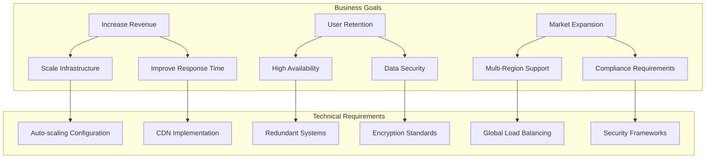
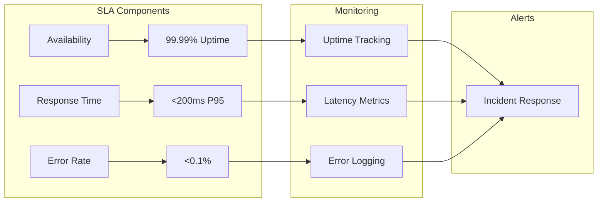
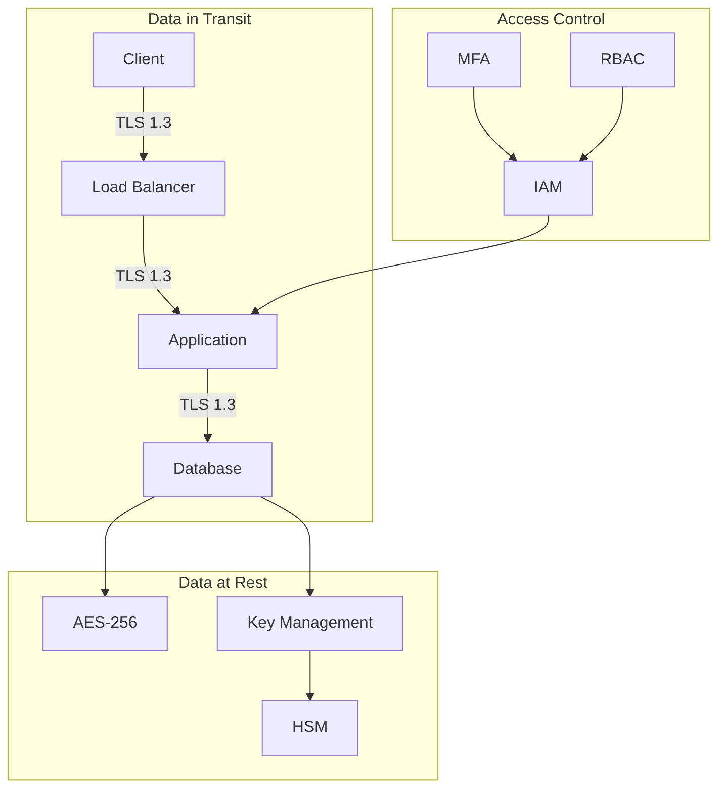
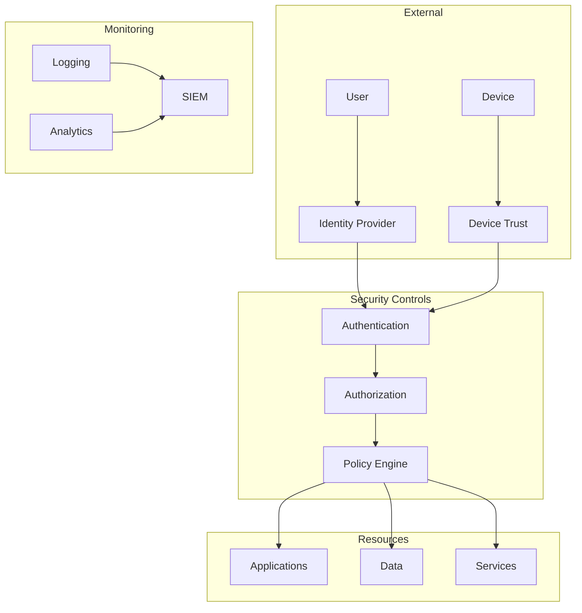
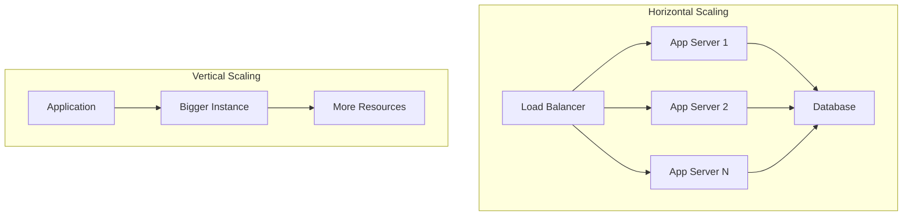
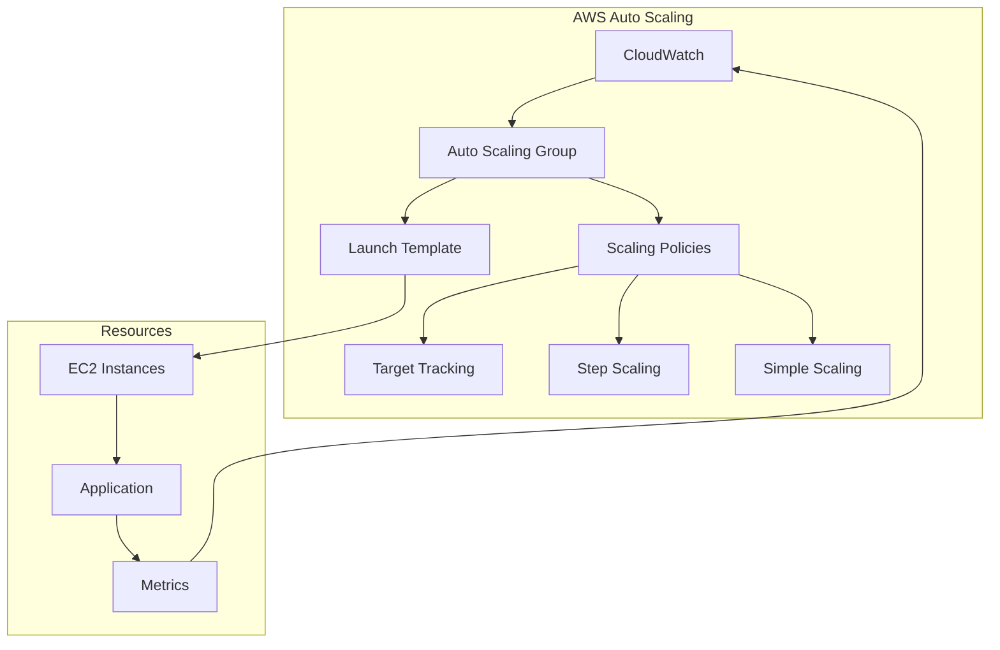
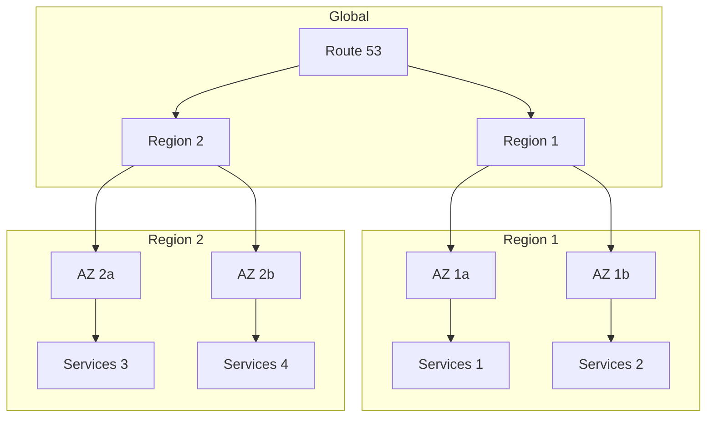
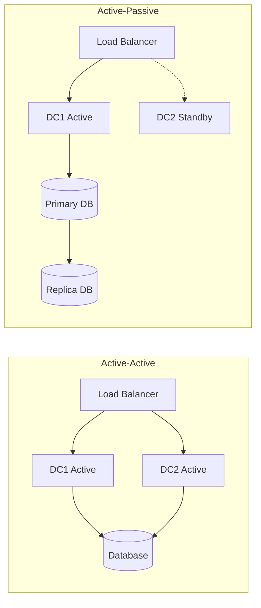
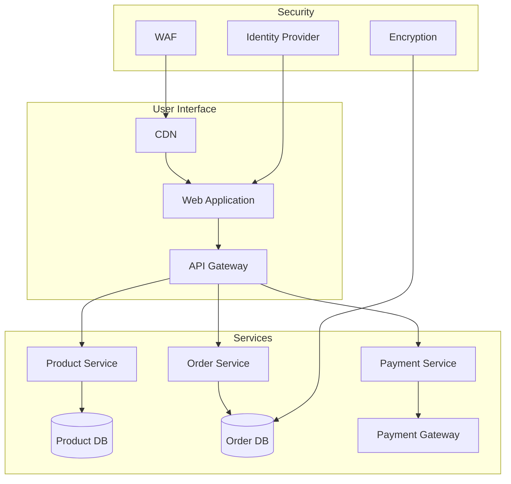

# Design Objectives and Requirements: A Comprehensive Guide

## Table of Contents
1. [Introduction](#introduction)
2. [User and Business Requirements](#user-business-requirements)
3. [Security Requirements](#security-requirements)
4. [Scalability and Elasticity](#scalability-elasticity)
5. [High Availability and Fault Tolerance](#high-availability)
6. [Real-world Case Studies](#case-studies)

## 1. Introduction <a name="introduction"></a>

This guide explores the fundamental aspects of design objectives and requirements in modern system architecture, incorporating industry best practices and real-world examples.

## 2. User and Business Requirements <a name="user-business-requirements"></a>

### 2.1 Business Goals to Technical Requirements Mapping



### 2.2 SLA Framework



### 2.3 Performance Goals Matrix

| Metric | Bronze Tier | Silver Tier | Gold Tier |
|--------|------------|-------------|-----------|
| Availability | 99.9% | 99.95% | 99.99% |
| Response Time | <500ms | <200ms | <100ms |
| Data Durability | 99.99% | 99.999% | 99.9999% |
| Support Response | <24h | <12h | <1h |

## 3. Security Requirements <a name="security-requirements"></a>

### 3.1 Encryption Architecture



### 3.2 Zero Trust Architecture



### 3.3 Secure Access Implementation

```python
from dataclasses import dataclass
from typing import List, Optional
import jwt

@dataclass
class SecurityContext:
    user_id: str
    roles: List[str]
    permissions: List[str]
    mfa_verified: bool
    device_trust_level: str
    
class ZeroTrustAccessControl:
    def __init__(self, policy_engine):
        self.policy_engine = policy_engine
        
    def verify_access(self, context: SecurityContext, resource: str) -> bool:
        if not context.mfa_verified:
            return False
            
        if context.device_trust_level not in ['HIGH', 'MEDIUM']:
            return False
            
        return self.policy_engine.evaluate(context, resource)
        
    def generate_access_token(self, context: SecurityContext) -> str:
        payload = {
            'uid': context.user_id,
            'roles': context.roles,
            'permissions': context.permissions,
            'mfa': context.mfa_verified,
            'device_trust': context.device_trust_level
        }
        return jwt.encode(payload, 'secret_key', algorithm='HS256')
```

## 4. Scalability and Elasticity <a name="scalability-elasticity"></a>

### 4.1 Scaling Patterns



### 4.2 Auto-scaling Configuration

```yaml
# Kubernetes HPA Example
apiVersion: autoscaling/v2
kind: HorizontalPodAutoscaler
metadata:
  name: application-hpa
spec:
  scaleTargetRef:
    apiVersion: apps/v1
    kind: Deployment
    name: application
  minReplicas: 3
  maxReplicas: 10
  metrics:
  - type: Resource
    resource:
      name: cpu
      target:
        type: Utilization
        averageUtilization: 70
  - type: Resource
    resource:
      name: memory
      target:
        type: Utilization
        averageUtilization: 80
```

### 4.3 Cloud Platform Elasticity



## 5. High Availability and Fault Tolerance <a name="high-availability"></a>

### 5.1 Multi-Region Architecture



### 5.2 Failover Patterns



### 5.3 Disaster Recovery Implementation

```python
from enum import Enum
from dataclasses import dataclass
from datetime import datetime
import boto3

class RecoveryStrategy(Enum):
    PILOT_LIGHT = "pilot_light"
    WARM_STANDBY = "warm_standby"
    MULTI_SITE = "multi_site"

@dataclass
class RecoveryPoint:
    timestamp: datetime
    backup_id: str
    region: str
    status: str

class DisasterRecoveryManager:
    def __init__(self, strategy: RecoveryStrategy):
        self.strategy = strategy
        self.aws_client = boto3.client('backup')
        
    def initiate_recovery(self, recovery_point: RecoveryPoint) -> bool:
        if self.strategy == RecoveryStrategy.PILOT_LIGHT:
            return self._pilot_light_recovery(recovery_point)
        elif self.strategy == RecoveryStrategy.WARM_STANDBY:
            return self._warm_standby_recovery(recovery_point)
        elif self.strategy == RecoveryStrategy.MULTI_SITE:
            return self._multi_site_failover(recovery_point)
            
    def _pilot_light_recovery(self, recovery_point: RecoveryPoint) -> bool:
        # Implementation for pilot light recovery
        pass
        
    def _warm_standby_recovery(self, recovery_point: RecoveryPoint) -> bool:
        # Implementation for warm standby recovery
        pass
        
    def _multi_site_failover(self, recovery_point: RecoveryPoint) -> bool:
        # Implementation for multi-site failover
        pass
```

## 6. Real-world Case Studies <a name="case-studies"></a>

### 6.1 E-commerce Platform Example



### 6.2 Requirements Traceability Matrix

| Business Requirement | Technical Solution | Implementation | Metrics |
|---------------------|-------------------|----------------|---------|
| 24/7 Availability | Multi-Region Deployment | Active-Active Setup | Uptime > 99.99% |
| Secure Transactions | Zero Trust Architecture | JWT + MFA | 0 Security Breaches |
| Scalable Platform | Auto-scaling | K8s HPA | Response Time < 200ms |
| Data Protection | Encryption | AES-256 | Compliance Audits |

## Conclusion

This guide provides a comprehensive framework for implementing design objectives and requirements in modern systems. Regular review and updates of these requirements ensure alignment with business goals and technical capabilities.
